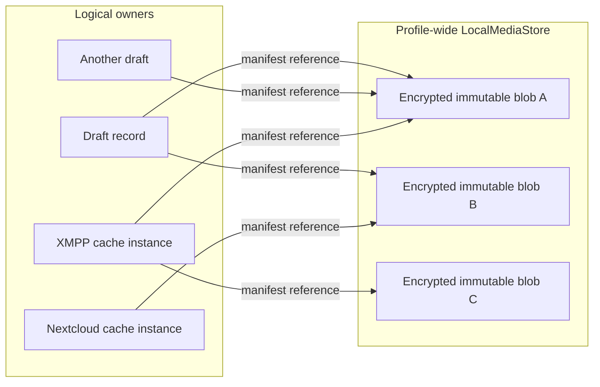
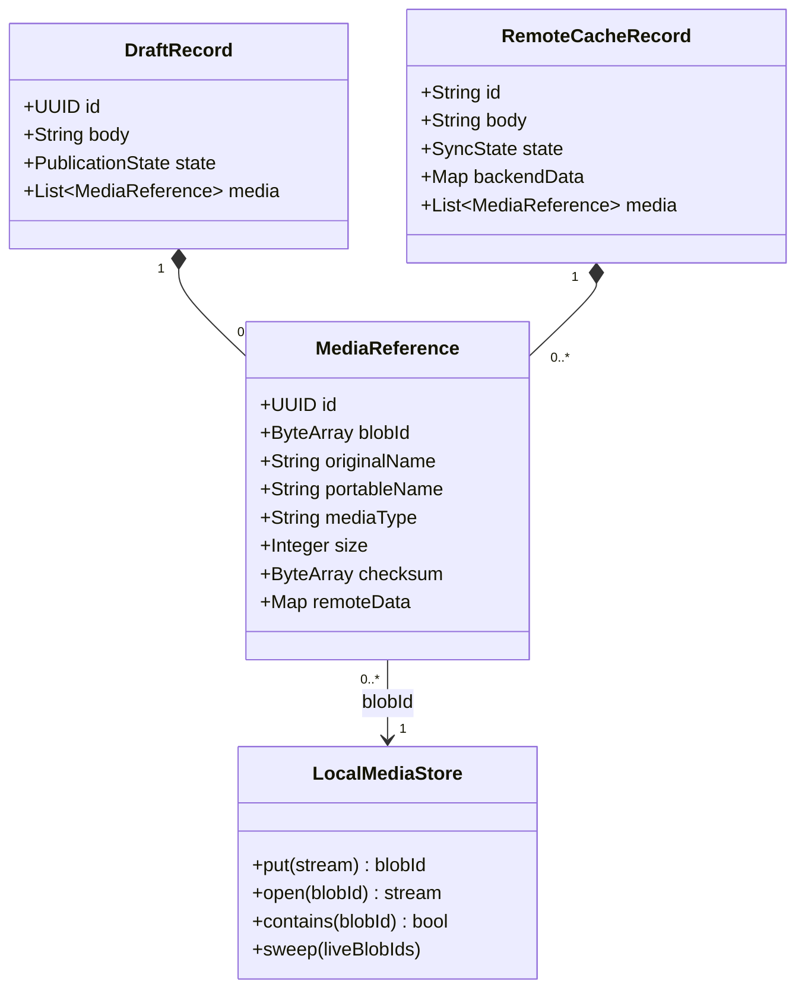
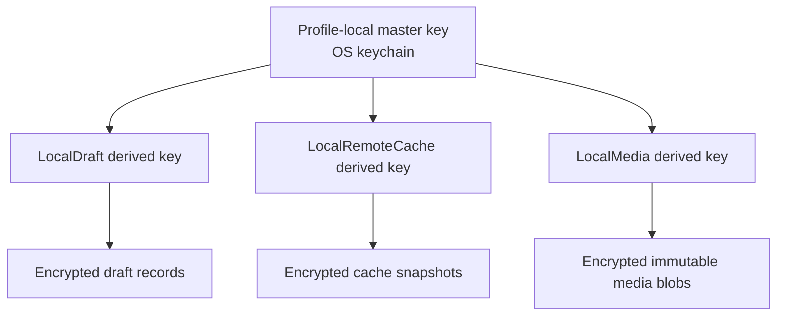
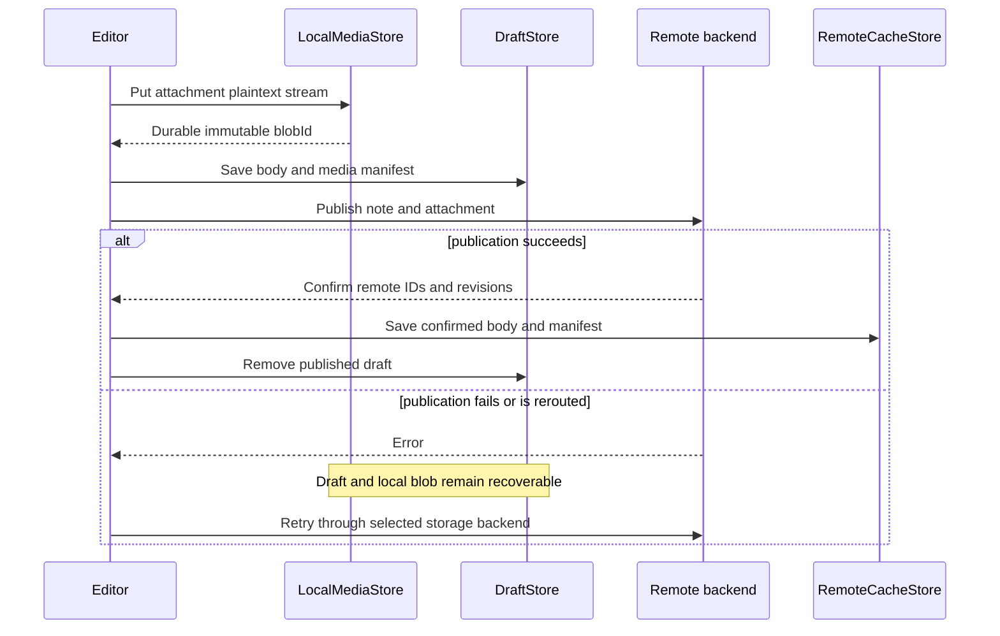
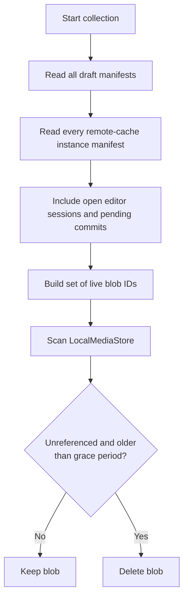
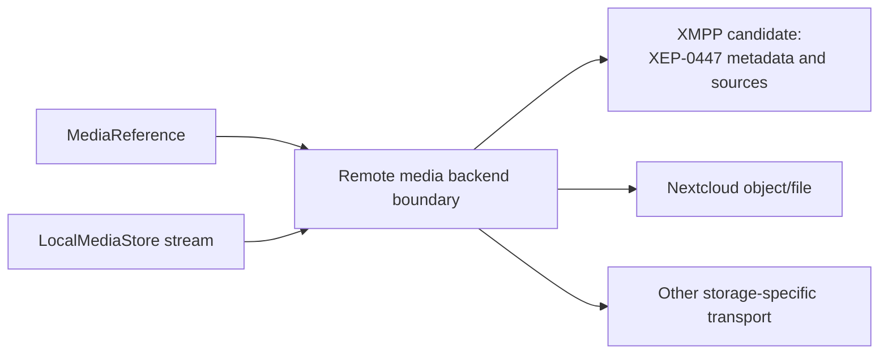
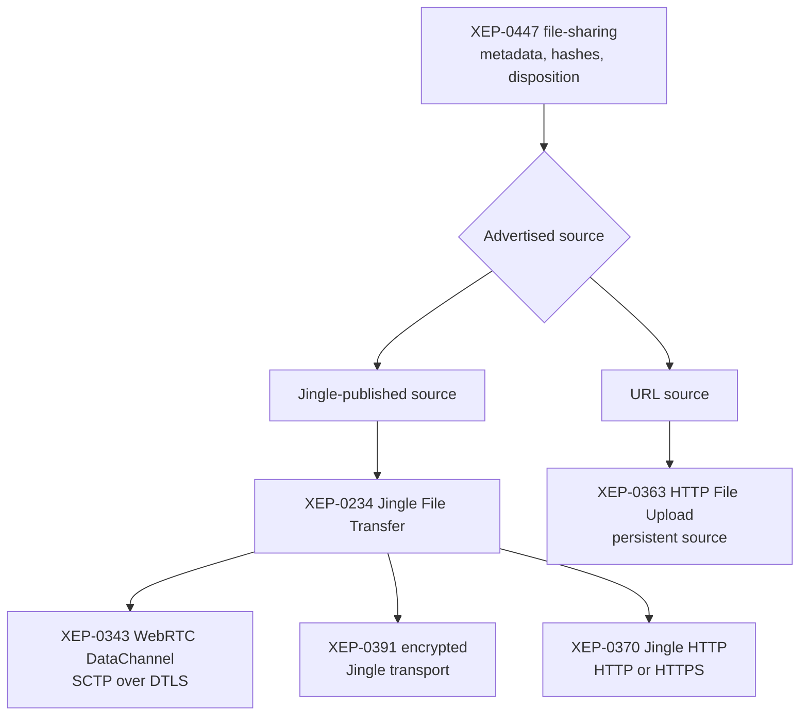

# Media storage architecture

Status: partially implemented. The shared encrypted local blob store, draft/cache
manifests, `qtnote-media:` references, image insertion, and PTF sidecars are in
place. Remote media transport and Tomboy/Gnote adapters remain future work.

QtNote notes are Markdown documents. Attachments and inline media are addressed
from Markdown by a stable attachment UUID and a readable portable filename:

```markdown
[Project budget.xlsx](qtnote-media:/7f28c5de-5f48-4d44-918f-b24d5b672f30/project-budget.xlsx)

```

The UUID is authoritative. The final URI component is only a readable fallback
for raw Markdown, recovery, and export. The link text or image alt text is the
user-editable description. The attachment manifest retains the original filename.

## Design goals

- render useful Markdown both in rendered and raw-source modes;
- keep drafts and remote caches encrypted at rest;
- avoid copying large attachments when a note moves between a cache and a draft;
- support rerouting a failed publication to another storage;
- preserve original filenames without using unsafe names on disk;
- deduplicate immutable local content;
- keep storage-specific transports behind backend interfaces;
- support multiple configured storage instances per plugin.

## Hybrid storage model

QtNote uses logically separate draft and remote-cache records, but they refer to
one profile-wide immutable media store. Each record owns its manifest; the shared
store owns only encrypted bytes.



This is hybrid rather than fully global storage: physical bytes are shared, while
ownership, synchronization state, original names, and remote metadata remain in
the draft or cache record that uses them.

An attachment blob is immutable. Editing an image or replacing a document creates
a new blob and updates the manifest. Existing notes and recoverable drafts continue
to reference the old content.

## Data model

The exact C++ API may evolve, but the persistent model should contain the following
information:

```cpp
struct MediaReference {
    QUuid id;                 // Attachment identity used by qtnote-media URIs.
    QByteArray blobId;        // Identity of immutable local content.
    QString originalName;     // Original display/export filename.
    QString portableName;     // Cross-platform fallback used in the URI.
    QString mediaType;        // Validated MIME type.
    qint64 size = 0;
    QByteArray checksum;      // Plaintext integrity metadata.
    QVariantMap remoteData;   // Backend-specific source/object metadata.
};
```

`DraftRecord` and `RemoteCacheRecord` each persist a list of `MediaReference`
objects. A media reference is not a filesystem path and does not contain encrypted
blob bytes.



## Blob identity and layout

The preferred blob identifier is a keyed content digest:

```text
blobId = HMAC-SHA-256(derived media-ID key, plaintext bytes)
```

It permits local deduplication without exposing a directly testable ordinary
content hash in filenames. The encrypted envelope still records and authenticates
the expected identifier, size, schema, and object kind.

A sharded physical layout avoids oversized directories:

```text
<QtNote data>/media/
  ab/
    cd/
      abcdef...blob
```

Blob files never use the original filename. Original and portable filenames are
encrypted manifest metadata.

## Encryption domains

Drafts, remote caches, and shared media use the same profile-local master key from
the operating-system keychain, but different derived encryption domains:



All three use the same authenticated-encryption implementation. Domain separation
prevents a cache record, draft record, and media blob from being substituted for
one another. Media has one shared domain because every manifest refers to the same
physical `LocalMediaStore` object.

## Editing, publication, and rerouting

Blob bytes are written before the new manifest is committed. A crash can therefore
leave an unreferenced blob, which is safe and can be collected later. A manifest
must never reference a blob that has not been durably committed.



Creating a draft from a cached note copies the body and manifest metadata, but not
the media bytes. Successful publication similarly installs references in the cache
without copying local blobs. Publishing to a remote service necessarily decrypts
the local blob stream and transforms or encrypts it for that service; this does not
modify the local blob.

## Garbage collection

Persistent reference counters are deliberately avoided because a crash between a
manifest update and a counter update could make them incorrect. Collection uses a
mark-and-sweep pass:



The grace period protects interrupted imports, publication rerouting, rollback, and
older cache snapshots. Collection must skip manifests it cannot authenticate or
read; unreadable ownership information must never be interpreted as an empty set.

## Filenames and export

`originalName` is preserved as metadata after Unicode validation and a length
limit. It is never trusted as a path. `portableName` is generated for the Markdown
URI and filesystem materialization by:

- removing control characters and path separators;
- replacing Windows-reserved characters;
- rejecting `.` and `..`;
- handling reserved device names such as `CON`, `PRN`, `AUX`, and `NUL`;
- removing trailing spaces and periods;
- bounding the encoded filename length while preserving the extension;
- resolving collisions with deterministic numeric suffixes.

PTF, Tomboy, and similar file-oriented stores may materialize attachments in a
sidecar directory named after the note. This is a storage adapter representation,
not QtNote's internal ownership model:

```text
note.ptf
note/
  project-budget.xlsx
  IMG_142315.png
```

The adapter converts `qtnote-media:` URIs to relative paths on export and performs
the inverse import into `LocalMediaStore` on load.

## Remote backend boundary

The local media model is independent of the remote transport. Each remote storage
adapter maps a `MediaReference` and local plaintext stream to its native object and
stores the resulting remote metadata in its own manifest.



### XMPP direction

[XEP-0447: Stateless File Sharing](https://xmpp.org/extensions/xep-0447.html)
is the current candidate for representing XMPP attachments. It provides generic
file metadata, hashes for integrity and caching, inline/attachment disposition,
and one or more transport-independent sources. XEP-0447 does not itself define
byte storage or transport, but a source can advertise a published Jingle session.
The receiver can then request the content using
[XEP-0234: Jingle File Transfer](https://xmpp.org/extensions/xep-0234.html)
and negotiate an appropriate Jingle transport.



Jingle therefore does not imply one fixed byte channel. A WebRTC DataChannel
transport uses SCTP over DTLS and protects the transferred media. Jingle Encrypted
Transports can add an end-to-end encryption layer around a negotiated Jingle
transport, including a transport whose underlying exchange is HTTP. Jingle's HTTP
transport can itself use HTTPS. These layers must be recorded separately in the
protocol design: HTTPS protects a client-to-server hop, DTLS protects its channel,
and a Jingle end-to-end encryption layer protects the file stream between the
participating XMPP entities.

For persistent notes, source lifetime remains important. A direct DataChannel is
useful while another device is online, but is not by itself durable storage. An
HTTP-uploaded source is naturally available to offline devices, but QtNote must
decide whether it stores plaintext behind HTTPS or uploads an independently
encrypted object whose key is distributed through the authenticated XMPP storage
protocol. Multiple XEP-0447 sources may allow both paths for the same content.

The specification is Experimental, and its primary examples use messages,
Carbons, and MAM. Before implementation QtNote still needs to define how an
XEP-0447 file-sharing description and its source lifetime are bound to a persistent
note revision in the private PubSub protocol. The design must also decide:

- which source protocols QtNote requires, prefers, or advertises together;
- which Jingle transports and end-to-end encryption profiles are interoperable;
- how remote attachment encryption and key rotation work;
- whether sources survive as long as their note revisions;
- how replacement and deletion avoid breaking older revisions;
- how hashes map to the local keyed `blobId` without publishing the keyed value;
- which XEP-0446 metadata and thumbnails are retained in `MediaReference`.

Until those questions are specified, XEP-0447 is a direction and interoperability
target, not part of the implemented QtNote XMPP wire protocol.

## Failure and security rules

- Validate declared size, MIME type, decoded dimensions, and integrity digest.
- Enforce configurable per-file and aggregate limits before allocation or decode.
- Stream large files; do not require a complete plaintext copy in memory.
- Treat SVG, HTML, PDF, and active document formats as untrusted input.
- Never resolve attachment names as relative or absolute input paths.
- Do not automatically open downloaded attachments in external applications.
- Authenticate the encrypted envelope before exposing any plaintext.
- Keep the draft until both note and required attachment publication are confirmed.
- Do not delete remote media merely because one local reference disappeared; the
  remote backend must apply its revision and ownership rules.

## Implementation stages

1. Add `MediaReference`, URI parsing, filename normalization, and Markdown
   rendering hooks.
2. Implement encrypted immutable `LocalMediaStore` and its tests.
3. Add media manifests to draft and remote-cache payload versions.
4. Implement insertion, preview, export, and safe external opening.
5. Add mark-and-sweep collection with a grace period.
6. Implement PTF/Tomboy sidecar adapters.
7. Specify and implement the XMPP mapping, using XEP-0447 where appropriate.
8. Define transports independently for other remote-storage plugins.
