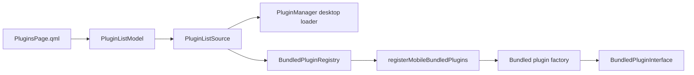

# Android bundled plugin loading

## Decision

Android uses an explicit factory registry for plugins compiled into the APK.
It does not use desktop shared-library discovery and does not rely on
`Q_IMPORT_PLUGIN` as the application-level plugin contract.

The shared pieces are:

- `PluginListSource`: UI-neutral source contract used by `PluginListModel`;
- `PluginManager`: desktop dynamic-plugin implementation of that contract;
- `BundledPluginRegistry`: Android/bundled implementation;
- `BundledPluginInterface`: lifecycle implemented by a bundled runtime;
- `registerMobileBundledPlugins()`: the explicit allow-list and factory table.

## Eligibility

A plugin may be registered for Android only when its runtime implementation:

- does not depend on QWidget or QDialog;
- does not take `QtNote::Main` as its core initialization contract;
- does not require DBus or desktop integration;
- does not depend on dynamic desktop plugin discovery;
- exposes settings through the future common settings controller/schema or a
  mobile QML component;
- can be built and linked into the Android target with all native dependencies.

Registration is explicit. Merely building a source directory does not make a
plugin available in the APK.

## Current state

The registry and shared model are active. The registration table is currently
empty because the existing storage/provider plugins still contain desktop UI or
host dependencies. They must be split into platform-neutral runtime and desktop
settings adapters before being added to the allow-list.
