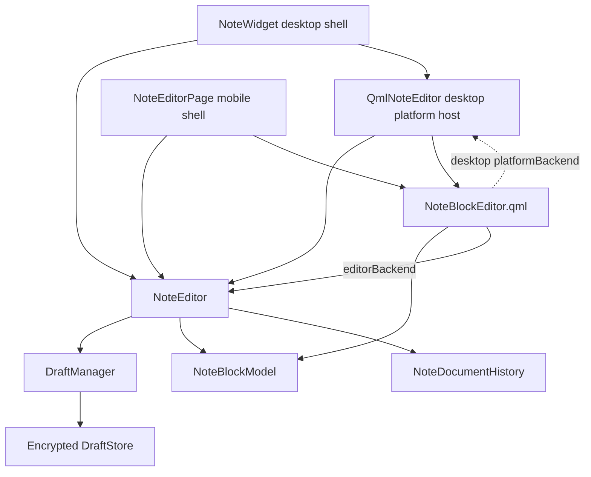
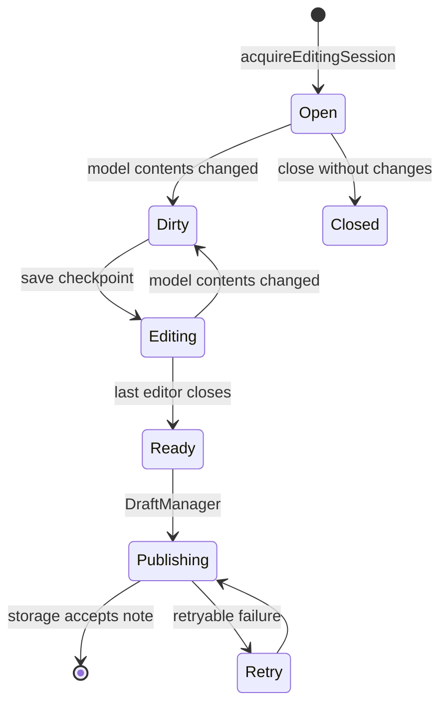

# Note editor architecture

## Goal

Desktop and mobile use one editing controller and one document model. Platform
views may provide different window chrome and system integrations, but they must
not implement note checkpoint, close, recovery, or draft lease rules themselves.

## Current structure

`NoteEditor` is the shared controller. It owns the logical `Note`, the draft
editing lease, canonical text, format and media state, one `NoteBlockModel`,
and the document-wide undo/redo history.
`NoteWidget` no longer keeps parallel note, baseline, dirty, draft revision, or
session state.

`NoteBlockEditor.qml` uses `NoteEditor` as its `editorBackend` on both
platforms. This API contains history, structured clipboard, formatting, link,
Markdown serialization, and media-manifest operations. The optional
`platformBackend` is present on desktop only and supplies spell checking,
native image drag, and Save As integration. Android passes `null` for it.

## Lifecycle ownership

Only `NoteEditor` performs the editing lifecycle transitions:

Entering the Android background checkpoints the current editor but does not
mark it ready. Android system Back closes through `NoteEditor::close()`. If the
process terminates after a checkpoint, the mobile application opens the
recoverable `Editing` draft when its storage becomes ready.

Before a mobile checkpoint, the QML shell commits the Android input method's
preedit text and flushes the active block delegate into `NoteBlockModel`. The
controller therefore never persists a visually newer but logically stale
document.

## Platform responsibilities

`NoteDocumentHistory` and `NoteBlockModel` are UI independent. `NoteEditor`
contains the shared QML-facing editing contract and therefore links Qt Quick,
but not Qt Widgets. It registers the QML root as a weak `QObject` view and uses
its `captureEditorState`, `prepareForHistoryRestore`, and `restoreEditorState`
methods. The surrounding shells are responsible only for platform services:

| Responsibility | Shared controller | Desktop shell | Mobile shell |
| --- | --- | --- | --- |
| Draft checkpoint and publication transition | Yes | No | No |
| Canonical document model | Yes | No | No |
| Undo/redo, structured clipboard, formatting, links and media manifest | Yes | No | No |
| Window geometry, pinning, printing | No | Yes | No |
| Spell checking, native image drag and Save As | No | Yes | No |
| Android activity state and system Back | No | No | Yes |
| QML block rendering | Shared QML | Host | Host |

## Remaining migration

1. Remove the compatibility forwarding API from `QmlNoteEditor` after desktop
   callers and tests use `NoteEditor` directly.
2. Reduce `QmlNoteEditor` to a `QQuickWidget` host with desktop drag, file dialog,
   and focus adapters. Rename it to reflect that responsibility.
3. Move the editor toolbar to an adaptive QML component shared by desktop and
   mobile.
4. Remove the legacy `NoteEdit : QTextEdit` compatibility path after all in-tree
   plugins use controller/highlighter APIs.
5. When no QWidget-only behavior remains in `NoteWidget`, replace it with the
   desktop QML window shell.

Each migration step must move the existing implementation and immediately make
both platforms use it. A parallel mobile implementation is not an acceptable
intermediate endpoint.
