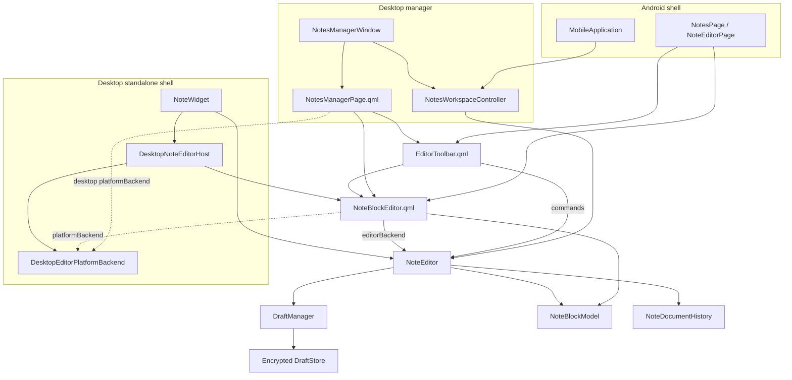
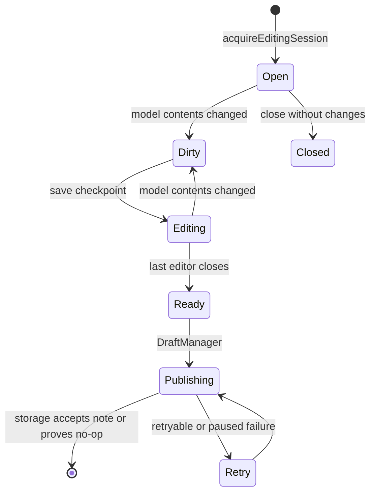
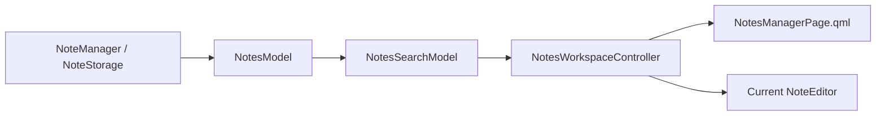

# Note editor architecture

## Goal

Desktop and Android use one editing controller, one structured document model,
one history implementation, one transfer/formatting contract, and one adaptive
QML toolbar. Platform shells provide only window chrome and operating-system
integrations. They do not implement checkpoint, close, recovery, publication,
or draft lease rules.

## Current structure

`NoteEditor` is the shared controller. It owns the logical `Note`, the draft
editing lease, canonical text, format and media state, one `NoteBlockModel`, and
the document-wide undo/redo history.

`NoteBlockEditor.qml` uses `NoteEditor` as its `editorBackend` on both
platforms. This API contains history, structured clipboard, formatting, links,
Markdown serialization, and media-manifest operations.

`DesktopEditorPlatformBackend` contains the optional desktop-only services:
spell checking, native image drag, file dialogs, image import, and Save As.
Android passes `null` as `platformBackend`.

`DesktopNoteEditorHost` is only a `QQuickWidget` host and a desktop event
adapter. It owns no document or draft state. The desktop note manager does not
use this QWidget host: it is a pure Qt Quick top-level window and connects the
same controller, model, toolbar, and block editor directly.

## Lifecycle ownership

Only `NoteEditor` performs editing lifecycle transitions:

Shells must flush their active QML delegate before asking `NoteEditor` to save or
close. Android additionally commits the input method's preedit text. Losing
focus checkpoints but does not mark a draft Ready. Closing a standalone window,
leaving an Android editor, switching the manager preview, or closing the manager
calls the same `NoteEditor::close()` protocol.

A clean editor receiving focus may call `reloadNewerDraft()`. It reads a newer
checkpoint from the same draft UUID and never reloads the origin storage over a
newer Editing draft. A dirty editor is not overwritten.

## Shared notes manager

The manager uses the existing data path rather than a second mobile model:

`NotesModel` exposes storage and note roles to QML, asynchronous per-storage
refresh, loading/error state, in-memory pagination, and drag metadata.
`NotesSearchModel` performs title/tag filtering and optional asynchronous body
search. `NotesWorkspaceController` is deliberately thin: it owns selection,
load jobs, create/delete/move commands, and the current `NoteEditor`, while all
draft semantics remain in `NoteEditor` and `DraftManager`.

`NotesManagerPage.qml` is adaptive. Desktop embeds the current editor beside the
notes tree. Android uses the same list/controller but opens the current editor
on its existing navigation page.

## Platform responsibilities

| Responsibility | Shared core/QML | Desktop-only | Android-only |
| --- | --- | --- | --- |
| Draft checkpoint, leases, close and publication transition | `NoteEditor` / `DraftManager` | No | No |
| Canonical document model and history | `NoteEditor` / `NoteBlockModel` | No | No |
| Clipboard, formatting, links and Markdown serialization | `NoteEditor` / shared QML | No | No |
| Editor toolbar | `EditorToolbar.qml` | Host | Host |
| Notes list/search/workspace | Shared model/controller/QML | Pure Quick window | Mobile navigation shell |
| Spell checking, native image drag and file dialogs | No | `DesktopEditorPlatformBackend` | No |
| Window geometry, pinning, printing, speech and legacy plugins | No | `NoteWidget` temporarily | No |
| IME/background/system Back handling | No | No | Mobile shell |

## Remaining migration

1. Remove the legacy hidden `NoteEdit : QTextEdit` compatibility path after all
   in-tree plugins use controller/highlighter APIs. Find/replace and print/export
   must then operate on the structured editor or a temporary `QTextDocument`.
2. Move the remaining standalone-window services out of `NoteWidget` and choose
   the final desktop QML window shell.
3. Replace the mobile placeholder plugin/storage models with the common plugin
   and storage models, then define Android bundled plugin loading.
4. Design and migrate the common settings API.
5. Complete Android IME, process-death, rotation, device, and release-build
   hardening.

Each migration step must move the existing implementation and immediately make
both platforms use it. A parallel mobile implementation is not an acceptable
intermediate endpoint.
