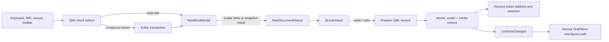
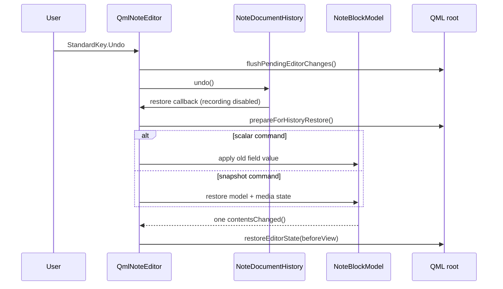

# Note editor undo and redo architecture

Status: the hybrid history core is implemented. `QmlNoteEditor` owns a private
`NoteDocumentHistory` and one bounded `QUndoStack`; ordinary field edits use
small value deltas, while structural and compound edits use exact internal
snapshots. Keyboard and context-menu undo/redo operate on that document-wide
stack rather than on an individual QML `TextArea`. Android/IME validation and
large-document profiling remain follow-up work.

This document defines undo and redo for the structured QML note editor. It
covers ordinary text, headings, mixed lists, task state, tables, images,
links, structured clipboard operations, format conversion, draft checkpoints,
and multiple editor sessions.

## Goals and invariants

1. One `QmlNoteEditor` owns one ordered history. Individual block delegates do
   not own independent user-visible histories.
2. `NoteBlockModel` remains the source of truth. A history entry is complete
   only after all visible editor changes have reached the model.
3. One user action is one undo step, even when it invokes several model
   mutations. For example, splitting a list item updates the old item and
   inserts a new item atomically.
4. Undo and redo restore the cursor and selection to the state associated with
   the restored document version.
5. Restoring history is atomic from QML's point of view. Delegates must not
   observe intermediate states or commit stale text while being destroyed.
6. A DraftStore checkpoint does not clear history. Loading a different or
   externally newer document does clear history.
7. History stores the internal block representation, not a Markdown round
   trip. Undo must not introduce serializer canonicalisation or parser loss.
8. Media blobs are immutable and are not deleted by undo. The document media
   manifest is restored together with image blocks.
9. Platform-standard undo and redo sequences are used. Input-method edits must
   work on desktop and Android without relying solely on `Ctrl` key events.

## Ownership and data flow



`QmlNoteEditor` owns `NoteDocumentHistory`. The history may use
`NoteBlockModel`'s private mutation and snapshot API, but storage and draft
classes do not participate in individual undo commands. `NoteWidget` remains
responsible for checkpoint scheduling and publication lifecycle.

## Current implementation

The implementation establishes the required boundaries and already records
user-visible history:

- `NoteBlockEditor.qml` uses one logical address and one pending-focus path for
  text blocks, headings, list items, table cells, and image fields;
- editor view state can be captured and restored without retaining delegate
  pointers;
- `prepareForHistoryRestore()` invalidates delayed focus requests, clears
  cross-editor selection, and moves focus away from delegates before a future
  model restore;
- `runEditTransaction(kind, callback)` surrounds compound list, table,
  clipboard, formatting, link, and spelling mutations; matching external
  transactions cover QWidget toolbar/media actions;
- text flushes occur before the outer mutation only when the visible text is
  actually newer than its observed model value;
- scalar model setters ignore equal values and therefore do not emit false
  `contentsChanged()` signals;
- `QmlNoteEditor::LoadPolicy` distinguishes document replacement, format
  conversion, and non-user replacement; `NoteWidget` passes the
  policy explicitly instead of relying on content comparison heuristics.

The outer QML transaction starts and ends a matching C++ history transaction.
String-valued setters report their exact old/new value and logical field to the
history without copying the document. Consecutive insertion or deletion edits
in that field merge for up to one second. Structural transaction boundaries
deep-copy the private block state and media manifest. Each stack is limited to
256 commands. A restore first makes the existing delegates safe, applies either
one scalar value or an exact snapshot, and restores the logical view address on
the next event-loop turn.

`NoteBlockModel::Block`, `State`, and their snapshot/restore methods remain
private implementation details. `notedocumenthistory.h` is a private build
header and is deliberately excluded from the installed libqtnote SDK.

## Editor addresses and view state

Rows, list items, and table cells are separate QML objects. Cursor restoration
therefore uses a logical address instead of a delegate pointer:

```text
EditorAddress
    blockIndex
    listItemIndex       (-1 when not a list item)
    tableCellIndex      (-1 when not a table cell)
    field               text, heading, listItem, tableCell, imageAlt, imageUrl
    cursorPosition
    selectionStart
    selectionEnd
```

`EditorViewState` adds the normalized cross-editor selection endpoints,
whole-document selection state, and vertical scroll position. Index addresses
are valid for undo because commands are applied in stack order: structural
commands that changed an index are reverted before older scalar commands that
refer to that index.

QML exposes a single focus boundary:

```qml
function editorAddress(editor, position)
function captureEditorState()
function focusEditorAddress(address)
function restoreEditorState(state)
function flushPendingEditorChanges()
function prepareForHistoryRestore()
function documentHistoryOwnsFocus()
```

Focus requests may outlive a delegate. The root editor stores one pending
address, scrolls its block into view, and retries after delegates are created.
List- and table-specific pending-focus variables are not permitted. If an exact
address cannot be restored, the fallback order is the closest editor in the
same block, the preceding editor, and finally the first document editor.

## Command representation

The implemented representation is hybrid. A keystroke in a field does not
capture `NoteBlockModel::State`; it records only that field's address and old/new
string. Exact document snapshots are reserved for structural or explicitly
compound actions. Snapshot creation deep-copies the internal block containers,
so retained history never shares mutable list/table storage with the live model.

### Scalar edit

`ScalarCommand` stores one target address and its old and new `QString`. It is
used for:

- text and heading source;
- list item source;
- table cell source;
- image URL and alternative text.

Task checked state and other non-string metadata currently travel through an
explicit transaction and therefore use a snapshot command. They can be moved
to typed deltas later if profiling shows a benefit.

Adjacent scalar commands can merge when they target the same field, represent
the same operation class (insertion or deletion), and no cursor, selection,
focus, checkpoint, or structural boundary occurred between them.

### Structural edit

`SnapshotCommand` stores the private model state before and after an operation:

```cpp
struct NoteBlockModel::State {
    QList<Block> blocks;
    bool markdown;
};
```

It is used for block insertion/removal, list topology and indentation, table
geometry, structural selection deletion, fragment insertion, and format
conversion. `previewUrls_` is derived display data and is excluded.

### Document/media edit

Every snapshot command carries the complete `QList<MediaReference>` alongside
the model state. This matters for image insertion and media-bearing paste: redo
must still restore the manifest after an intervening draft checkpoint has
pruned the current note manifest. Blob bytes stay in `LocalMediaStore`; orphan
collection is a separate operation outside history.

### Compound edit

A compound transaction captures one before/after document snapshot and appears
as one `QUndoStack` entry, regardless of how many setters it invokes. Compound
operations include:

- splitting a list item with Enter;
- converting or removing the final empty list item;
- removing the sole table block and creating a replacement text block;
- formatting a selection spanning several editors;
- cross-block cut, delete, and paste;
- image insertion plus media-manifest update;
- Markdown/plain-text conversion.

Commands are pushed after their mutations have already executed. The command
wrapper therefore skips the initial `redo()` performed by `QUndoStack::push()`;
later redo calls apply the stored after-state normally.

## Transaction boundary

QML uses one helper instead of hand-written begin/end calls:

```qml
function runEditTransaction(kind, callback) {
    beginEditTransaction(kind)
    try {
        return callback()
    } finally {
        endEditTransaction()
    }
}
```

Nested transactions are allowed. Only the outer transaction captures view
state and creates a stack entry. A direct string-field mutation outside a
transaction creates a scalar command; any other direct model mutation falls
back to one snapshot command, so a missed QML call site cannot silently become
non-undoable.

The outer `beginEditTransaction()` flushes pending text before it captures the
before-state. C++-initiated toolbar/media transactions use the same ordering,
and undo/redo also flush once before choosing the command to apply. Operations
that directly modify a `QTextDocument` (formatting, links, spelling replacement,
and plain-text fallback paste) commit that editor explicitly before returning.
The transaction wrapper must **not** blindly flush delegates after a structural
mutation: a delegate being destroyed can otherwise write its old text into a
newly shifted list item or table cell. Model setters ignore equal values, so the
initial flush cannot create false dirty state or an empty history entry.

## Typing merge rules

Sequential text changes merge only when all of the following hold:

- the logical scalar target is identical;
- both changes are insertions or both are deletions;
- there was no selection replacement or format operation;
- merge generation is unchanged;
- elapsed time is below the configured typing interval (initially 1000 ms).

The merge generation changes at navigation/selection boundaries, mouse press,
non-text shortcuts, structural transactions, undo/redo, and a successful draft
checkpoint. Empty transactions do not break a deletion or typing group. If a
merged command's new value becomes equal to its original value, it becomes
obsolete and is removed from the stack.

Keyboard auto-repeat may merge. Input-method events update the saved view state,
but committed/pre-edit behaviour still requires explicit platform tests,
especially on Android.

## Atomic restore

Undo and redo follow this sequence:



During restore, normal history recording is disabled. QML selection is cleared
and focus is moved away from delegates before a structural model reset. A
snapshot restore emits one model reset plus one `contentsChanged()`; a scalar
restore emits the relevant `dataChanged()` plus one `contentsChanged()`. This
prevents a destroyed delegate from writing stale source back into the restored
model while avoiding delegate recreation for ordinary typing undo.

## Keyboard and context-menu routing

`QmlNoteEditor::eventFilter()` handles `QKeySequence::Undo` and
`QKeySequence::Redo` before an individual text document. QML also handles
`StandardKey.Undo` and `StandardKey.Redo` as a platform-independent fallback.
Registered block `QTextDocument` instances have their local undo stack disabled
once the document history is active.

The context menu binds to `QmlNoteEditor.canUndo`, `canRedo`, `undoText`, and
`redoText`, never to `TextArea.canUndo`. A temporary link URL `TextField` is an
exception: while it has focus, standard undo/redo and copy/cut/paste remain
local to that field because its value has not yet been applied to the note. The
C++ event filter asks QML which side owns focus before routing any of those
shortcuts.

## Load, conversion, and draft policy

Document loads are classified explicitly:

```cpp
enum class LoadPolicy {
    ResetHistory,          // initial load, another note, newer external draft
    RecordFormatConversion,// user selected Markdown or plain text
    HistoryRestore         // non-user replacement; does not record conversion
};
```

Initial, external, and `HistoryRestore` loads reset the stack. Undo/redo itself
does not call `load()`; it restores the private model state directly. A user
format conversion is one snapshot command and emits `formatChanged`, so the
`NoteWidget` toolbar, legacy editor capabilities, and image actions follow the
restored mode.

A successful Editing checkpoint does not clear commands. It only breaks the
current typing merge. The existing `NoteWidget::_changed` lifecycle remains
authoritative; this implementation does not use `QUndoStack::isClean()` or mark
a clean history index.

Each open editor has its own transient history even when several windows share
one draft UUID. Adopting a newer checkpoint from another editor clears the
receiving window's history. A window with uncheckpointed changes keeps the
existing no-reload rule rather than attempting to rebase undo commands.

## Operation matrix

| User operation | History representation |
| --- | --- |
| Typing, Backspace, Delete within one field | mergeable scalar |
| Image URL or alternative text typing | mergeable scalar |
| Link, bold, italic, strike, code, spelling replacement | snapshot transaction |
| Task checkbox | snapshot transaction |
| List split, merge, indent, convert, remove | snapshot transaction |
| Table row or column edit | snapshot transaction |
| Cross-editor delete or cut | snapshot transaction |
| Plain or structured paste | snapshot transaction |
| Image insert or media-bearing paste | model/media snapshot transaction |
| Markdown/plain-text switch | snapshot transaction |
| Final speech-recognition append | explicit transaction |
| Selection, navigation, scroll, find | not recorded |
| Spell dictionary and editor settings | not recorded |
| Checkpoint, publish, export, print, pin | not recorded |

## Failure handling

- A failed model or media operation does not push a command.
- An empty or net-zero transaction is discarded.
- Missing image bytes do not corrupt history: the reference and block are
  restored and the renderer displays its normal unavailable-media state.
- An invalid saved view address falls back to the nearest valid editor.
- An external reload cancels any pending transaction before clearing history.
- Command labels are translated user-facing strings; internal operation keys
  and note contents are not exposed in the context menu.

## Implementation stages

1. **Preparation:** unify editor addressing/focus, add transaction and flush
   boundaries, make scalar setters ignore equal values, and classify loads.
   **Complete.**
2. **Core history:** implement scalar and snapshot commands, `QUndoStack`
   properties, private model state restore, and atomic application.
   **Complete.**
3. **Plain-text vertical slice:** typing, deletion, paste, shortcuts, context
   menu, cursor restore, and merge rules. **Complete for desktop tests.**
4. **Markdown scalar edits:** text, headings, list items, cells, links,
   formatting, task state, image fields, and spelling replacement.
   **Complete; non-string/compound operations intentionally use snapshots.**
5. **Structure:** list/table/block operations and cross-editor clipboard edits.
   **Complete for the existing editor operations.**
6. **Media and conversion:** media manifests, images, format switching, and
   speech insertion. **Complete for current insertion paths.**
7. **Lifecycle and platforms:** checkpoint boundaries, multi-editor reload,
   IME, Android, limits, and performance profiling. **Partial:** checkpoints
   break merge and external draft adoption resets history; IME/Android and
   large-note profiling remain.

## Automated coverage and remaining tests

Current model/QML tests cover scalar change reporting, merged typing and
Backspace, separation of insertion from deletion, cursor restore, list split,
table insertion, formatting, table-cell and image-field edits, media-manifest
restore, format conversion, automatic plain-to-Markdown toolbar grouping,
cross-block delete/paste, and local undo/paste in the temporary link URL field.

Still required before calling the feature platform-complete:

- committed text and composition tests through real input methods;
- Android keyboard, lifecycle, and focus tests;
- explicit history branching and 256-command eviction tests;
- checkpoint/focus hand-off tests with two live editors of one draft;
- profiling on large notes with wide tables and deeply nested lists.

QML tests must activate exactly one `QQuickWidget` per interaction and use the
offscreen clipboard backend in CI. Otherwise asynchronous focus restoration or
a desktop clipboard manager can masquerade as a history failure.
