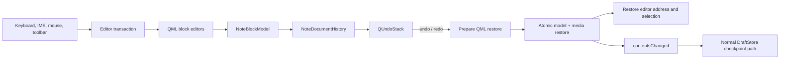
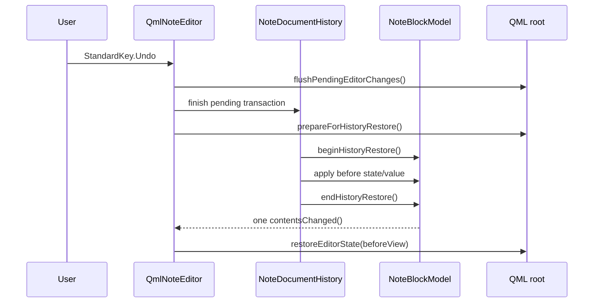

# Note editor undo and redo architecture

Status: design approved; the preparatory editor refactoring described below is
implemented. The core `NoteDocumentHistory` and `QUndoStack` are not implemented
yet. Consequently, the current context menu still exposes the undo stack of an
individual QML `TextArea`. That behaviour is temporary and must be replaced by
the document history described here.

This document defines undo and redo for the structured QML note editor. It
covers ordinary text, headings, mixed lists, task state, tables, images,
links, structured clipboard operations, format conversion, draft checkpoints,
and multiple editor sessions.

## Goals and invariants

1. One `QmlNoteEditor` owns one ordered history. Individual block delegates do
   not own independent user-visible histories.
2. `NoteBlockModel` remains the source of truth. A history entry is complete
   only after all visible editor changes have reached the model.
3. One user action is one undo step, even when it invokes several model
   mutations. For example, splitting a list item updates the old item and
   inserts a new item atomically.
4. Undo and redo restore the cursor and selection to the state associated with
   the restored document version.
5. Restoring history is atomic from QML's point of view. Delegates must not
   observe intermediate states or commit stale text while being destroyed.
6. A DraftStore checkpoint does not clear history. Loading a different or
   externally newer document does clear history.
7. History stores the internal block representation, not a Markdown round
   trip. Undo must not introduce serializer canonicalisation or parser loss.
8. Media blobs are immutable and are not deleted by undo. The document media
   manifest is restored together with image blocks.
9. Platform-standard undo and redo sequences are used. Input-method edits must
   work on desktop and Android without relying solely on `Ctrl` key events.

## Ownership and data flow



`QmlNoteEditor` owns `NoteDocumentHistory`. The history may use
`NoteBlockModel`'s private mutation and snapshot API, but storage and draft
classes do not participate in individual undo commands. `NoteWidget` remains
responsible for checkpoint scheduling and publication lifecycle.

## Current preparatory implementation

The first implementation stage deliberately changes no user-visible undo
semantics yet. It establishes the boundaries to which history will attach:

- `NoteBlockEditor.qml` uses one logical address and one pending-focus path for
  text blocks, headings, list items, table cells, and image fields;
- editor view state can be captured and restored without retaining delegate
  pointers;
- `prepareForHistoryRestore()` invalidates delayed focus requests, clears
  cross-editor selection, and moves focus away from delegates before a future
  model restore;
- `runEditTransaction(kind, callback)` now surrounds compound list, table,
  clipboard, formatting, link, spelling, and toolbar mutations;
- text flushes occur before the outer mutation only when the visible text is
  actually newer than its observed model value;
- scalar model setters ignore equal values and therefore do not emit false
  `contentsChanged()` signals;
- `QmlNoteEditor::LoadPolicy` distinguishes document replacement, format
  conversion, and the reserved history-restore path; `NoteWidget` passes the
  policy explicitly instead of relying on content comparison heuristics.

The transaction helper currently provides grouping and safe flush semantics
only. Stage 2 will connect its outer begin/end calls to
`NoteDocumentHistory`; until then the `kind` string is intentionally metadata
without a backend consumer.

## Editor addresses and view state

Rows, list items, and table cells are separate QML objects. Cursor restoration
therefore uses a logical address instead of a delegate pointer:

```text
EditorAddress
    blockIndex
    listItemIndex       (-1 when not a list item)
    tableCellIndex      (-1 when not a table cell)
    field               text, heading, listItem, tableCell, imageAlt, imageUrl
    cursorPosition
    selectionStart
    selectionEnd
```

`EditorViewState` adds the normalized cross-editor selection endpoints,
whole-document selection state, and vertical scroll position. Index addresses
are valid for undo because commands are applied in stack order: structural
commands that changed an index are reverted before older scalar commands that
refer to that index.

QML exposes a single focus boundary:

```qml
function editorAddress(editor, position)
function captureEditorState()
function focusEditorAddress(address)
function restoreEditorState(state)
function flushPendingEditorChanges()
function prepareForHistoryRestore()
```

Focus requests may outlive a delegate. The root editor stores one pending
address, scrolls its block into view, and retries after delegates are created.
List- and table-specific pending-focus variables are not permitted. If an exact
address cannot be restored, the fallback order is the closest editor in the
same block, the preceding editor, and finally the first document editor.

## Command representation

A full document snapshot for every typed character is deliberately avoided.
Holding a shared `QList<Block>` snapshot would force the model's block list to
detach on every subsequent character. History therefore uses a hybrid command
set.

### Scalar edit

`ScalarEditCommand` stores one target address and its old and new values. It is
used for:

- text and heading source;
- list item source;
- table cell source;
- image URL and alternative text;
- task checked state.

Adjacent scalar commands can merge when they target the same field, represent
the same operation class (insertion or deletion), and no cursor, selection,
focus, checkpoint, or structural boundary occurred between them.

### Structural edit

`StructuralEditCommand` stores `NoteBlockModelState` before and after an
operation:

```cpp
struct NoteBlockModelState {
    QList<Block> blocks;
    bool markdown;
};
```

It is used for block insertion/removal, list topology and indentation, table
geometry, structural selection deletion, fragment insertion, and format
conversion. `previewUrls_` is derived display data and is excluded.

### Document/media edit

Image insertion and media-bearing paste additionally store the complete
`QList<MediaReference>`. Redo must still work after an intervening draft
checkpoint has pruned the current note manifest. Blob bytes stay in
`LocalMediaStore`; orphan collection is a separate operation outside history.

### Compound edit

A compound transaction contains scalar and/or structural changes but appears
as one `QUndoStack` entry. Required compound operations include:

- splitting a list item with Enter;
- converting or removing the final empty list item;
- removing the sole table block and creating a replacement text block;
- formatting a selection spanning several editors;
- cross-block cut, delete, and paste;
- image insertion plus media-manifest update;
- Markdown/plain-text conversion.

Commands are pushed after their mutations have already executed. The command
wrapper therefore skips the initial `redo()` performed by `QUndoStack::push()`;
later redo calls apply the stored after-state normally.

## Transaction boundary

QML uses one helper instead of hand-written begin/end calls:

```qml
function runEditTransaction(kind, callback) {
    beginEditTransaction(kind)
    try {
        return callback()
    } finally {
        endEditTransaction()
    }
}
```

Nested transactions are allowed. Only the outer transaction captures view
state and creates a stack entry. A direct model mutation outside an explicit
transaction creates a fallback single command so that a missed QML call site
cannot silently become non-undoable.

The outer `beginEditTransaction()` flushes pending text before it captures the
before-state. Operations that directly modify a `QTextDocument` (formatting,
links, spelling replacement, and plain-text fallback paste) commit that editor
explicitly before returning. The transaction wrapper must **not** blindly
flush delegates after a structural mutation: a delegate being destroyed can
otherwise write its old text into a newly shifted list item or table cell.
Model setters ignore equal values so the initial flush cannot create false
dirty state or empty history entries.

## Typing merge rules

Sequential text changes merge only when all of the following hold:

- the logical scalar target is identical;
- both changes are insertions or both are deletions;
- there was no selection replacement or format operation;
- merge generation is unchanged;
- elapsed time is below the configured typing interval (initially 1000 ms).

The merge generation changes on cursor navigation, mouse press, selection
change, focus change, Enter, Tab, paste, cut, formatting, link application,
task toggle, undo/redo, and successful draft checkpoint. If a merged command's
new value becomes equal to its original value, it becomes obsolete and is
removed from the stack.

Keyboard auto-repeat may merge. IME pre-edit updates are not committed as
separate commands; the committed input-method event is one logical edit.

## Atomic restore

Undo and redo follow this sequence:



During restore, normal history recording is disabled. QML selection is cleared
and focus is moved away from delegates before a structural model reset. The
model suppresses intermediate row/data signals and emits one reset plus one
`contentsChanged()`. This prevents a destroyed delegate from writing stale
source back into the restored model.

## Keyboard and context-menu routing

`QmlNoteEditor::eventFilter()` handles `QKeySequence::Undo` and
`QKeySequence::Redo` before an individual text document. QML also handles
`StandardKey.Undo` and `StandardKey.Redo` as a platform-independent fallback.
Registered block `QTextDocument` instances have their local undo stack disabled
once the document history is active.

The context menu binds to `QmlNoteEditor.canUndo`, `canRedo`, `undoText`, and
`redoText`, never to `TextArea.canUndo`. A temporary URL `TextField` is an
exception: while it has focus, undo remains local to that field because its
value has not yet been applied to the note.

## Load, conversion, and draft policy

Document loads are classified explicitly:

```cpp
enum class LoadPolicy {
    ResetHistory,          // initial load, another note, newer external draft
    RecordFormatConversion,// user selected Markdown or plain text
    HistoryRestore         // internal undo/redo application
};
```

Initial and external loads increment the document generation and clear the
stack. Format conversion is one structural command and updates toolbar mode on
undo/redo. A command may only apply to the generation in which it was created.

A successful Editing checkpoint does not clear commands. It breaks the current
typing merge and marks the stack's current index as a checkpoint. The existing
`NoteWidget::_changed` lifecycle remains authoritative initially; it must not be
replaced by `QUndoStack::isClean()` until editor content, format, and media are
all proven to be represented by the history state.

Each open editor has its own transient history even when several windows share
one draft UUID. Adopting a newer checkpoint from another editor clears the
receiving window's history. A window with uncheckpointed changes keeps the
existing no-reload rule rather than attempting to rebase undo commands.

## Operation matrix

| User operation | History representation |
| --- | --- |
| Typing, Backspace, Delete within one field | mergeable scalar |
| Link, bold, italic, strike, code, spelling replacement | non-mergeable scalar/compound |
| Task checkbox | scalar boolean |
| List split, merge, indent, convert, remove | structural/compound |
| Table row or column edit | structural |
| Cross-editor delete or cut | structural compound |
| Plain text paste | scalar replacement |
| Structured list/table/note paste | structural compound |
| Image insert or media-bearing paste | document/media compound |
| Markdown/plain-text switch | structural compound |
| Final speech-recognition append | one explicit command |
| Selection, navigation, scroll, find | not recorded |
| Spell dictionary and editor settings | not recorded |
| Checkpoint, publish, export, print, pin | not recorded |

## Failure handling

- A failed model or media operation does not push a command.
- An empty or net-zero transaction is discarded.
- Missing image bytes do not corrupt history: the reference and block are
  restored and the renderer displays its normal unavailable-media state.
- An invalid saved view address falls back to the nearest valid editor.
- An external reload cancels any pending transaction before clearing history.
- A generation mismatch clears the stack and logs metadata only; note text is
  never written to logs.

## Implementation stages

1. **Preparation:** unify editor addressing/focus, add transaction and flush
   boundaries, make scalar setters ignore equal values, and classify loads.
2. **Core history:** implement command types, `QUndoStack` properties, model
   state snapshot/restore, and atomic application.
3. **Plain-text vertical slice:** typing, deletion, paste, shortcuts, context
   menu, cursor restore, and merge rules.
4. **Markdown scalar edits:** text, headings, list items, cells, links,
   formatting, task state, image fields, and spelling replacement.
5. **Structure:** list/table/block operations and cross-editor clipboard edits.
6. **Media and conversion:** media manifests, images, format switching, and
   speech insertion.
7. **Lifecycle and platforms:** checkpoint boundaries, multi-editor reload,
   IME, Android, limits, and performance profiling.

## Test requirements

The core history test covers scalar undo/redo, structural snapshots, compound
order, typing merge boundaries, net-zero commands, branching after undo, stack
limit, checkpoint boundaries, generation reset, exact list/table state, media,
and format conversion.

QML integration tests cover cursor and selection restoration in every editor
kind, one-step list split, table deletion/restoration, cross-block delete and
paste, context-menu enablement, both platform redo sequences, URL-popup local
undo, stale-delegate protection, focus loss, and committed input-method events.
Tests must activate exactly one `QQuickWidget` per interaction and isolate the
system clipboard; otherwise focus and clipboard-manager races can masquerade as
history failures.
