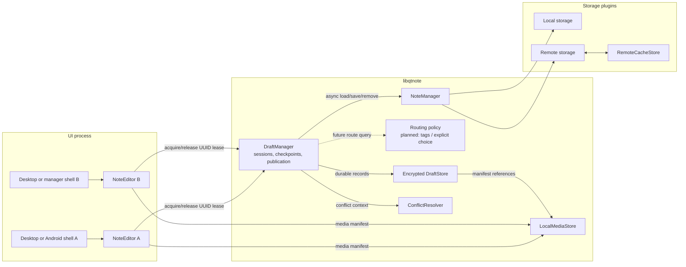
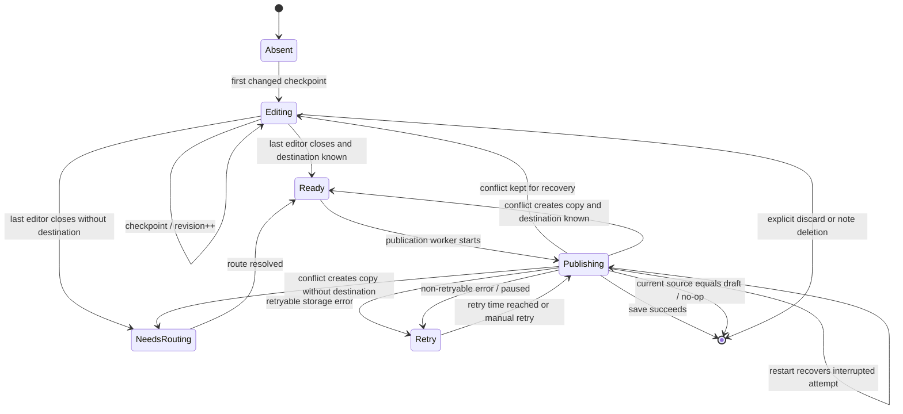
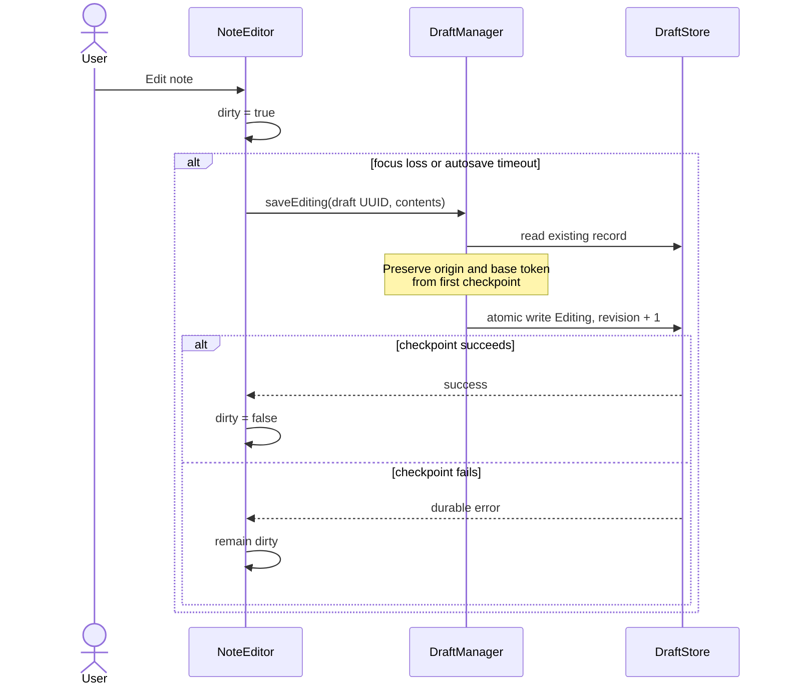
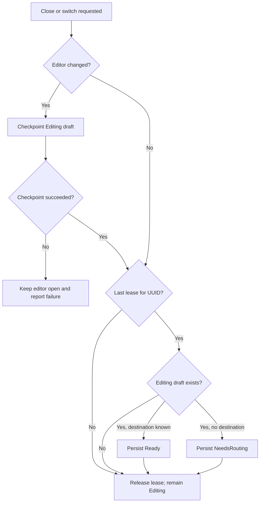
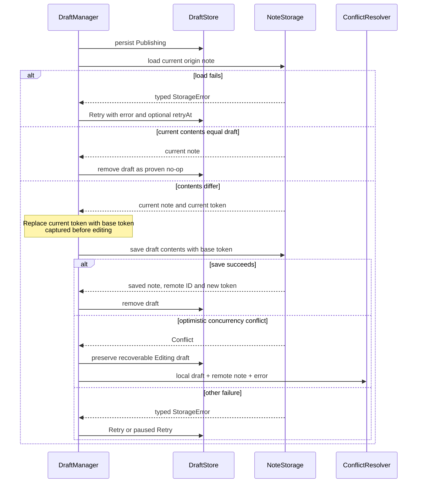
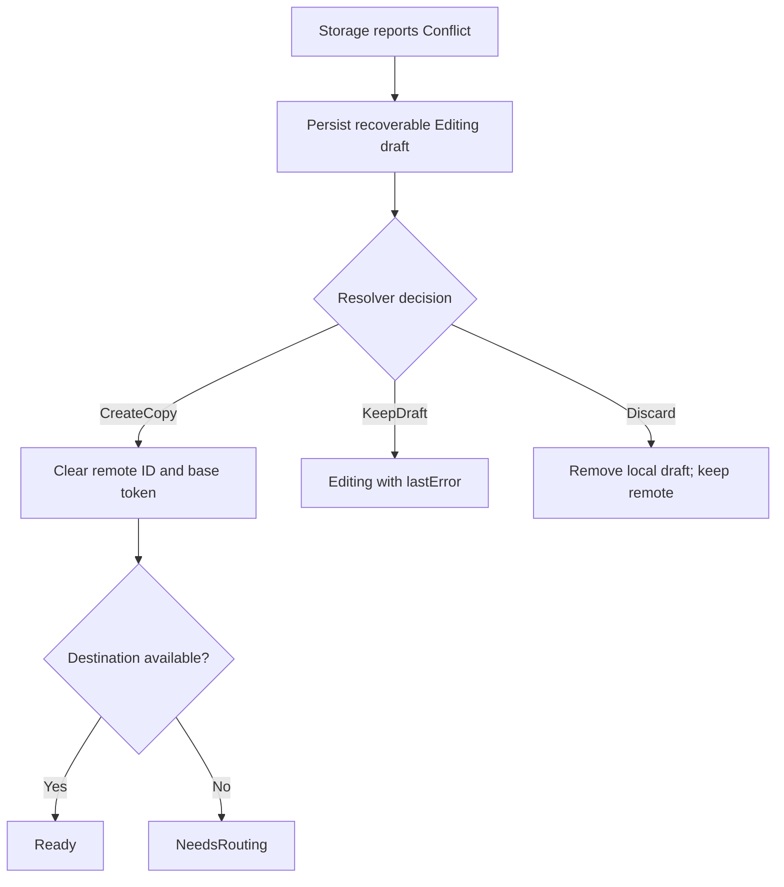
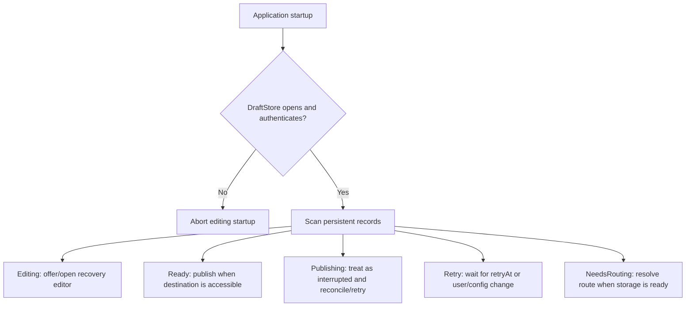

# Note lifecycle architecture

Status: the crash-safe draft, in-process multi-editor session, publication,
retry, and conflict foundations are implemented. Tag-based routing, cross-process
editing coordination, and fully durable publication reconciliation remain future
work. Statements under current implementation and planned improvements describe
known gaps rather than intended behavior.

This document defines the lifecycle of a logical note from opening through local
editing, publication, conflict handling, recovery, and deletion. Media byte
ownership is described separately in
[Media storage architecture](media-storage-architecture.md).

## Vocabulary and identity

- **Logical note** is the user-visible note, independent of a particular editor
  window or storage representation.
- **Editor session** is one `NoteEditor` instance, hosted by a desktop or Android shell,
  participating in the editing of a logical note.
- **Draft session** is the set of editor sessions sharing one draft UUID.
- **Checkpoint** is a durable `Editing` snapshot in `DraftStore`.
- **Origin** is the storage and note ID from which editing started. Either can be
  absent for a new or not-yet-routed note.
- **Base concurrency token** is opaque storage data captured when editing starts,
  such as an ETag, remote revision, or base version.
- **Publication destination** is selected by routing. It is not the identity of
  the draft.

The draft UUID is the authoritative identity of an editing session. It remains
stable when a new note has no remote ID, when routing changes its destination, and
when publication assigns a remote ID. `originStorageId + originNoteId` is useful
for finding an existing draft for an already published note, but is not a valid
primary identity for new or rerouted notes.

The current persistent field names are `storageId` and `remoteNoteId`. Their
initial meaning is origin. For a new or rerouted note the current implementation
also stores the resolved destination in `storageId`; separating the resolved route
from origin metadata is a future schema cleanup.

## Architectural invariants

1. While at least one editor session is open, the durable working copy is an
   `Editing` draft. The origin storage must not be published merely because an
   editor loses focus or the autosave timer fires.
2. An unchanged note does not need an initial checkpoint. Once a checkpoint
   exists, returning to the loaded baseline must itself be checkpointed so that
   stale intermediate content does not remain in DraftStore.
3. Losing focus and periodic autosave may create checkpoints. Receiving focus may
   only load a newer checkpoint from the same draft UUID; it must not reload the
   origin storage over a newer draft.
4. A draft becomes publishable only when the last editor session is explicitly
   closed, the note manager switches away from it, or the application performs an
   orderly close of that editor.
5. Failure to make the final checkpoint or state transition must keep the editor
   open whenever the UI still has control over closing.
6. The base concurrency token is captured once, at the first checkpoint, and is
   not replaced by tokens read immediately before publication.
7. A successful publication or a proven no-op is the only normal path that
   removes a publish draft.
8. Draft and cache manifests may share immutable media blobs, but publication
   state never owns or duplicates the media bytes themselves.

## Components and ownership



`NoteEditor` owns canonical in-memory content, the local dirty flag, the last
draft revision it has applied, the media manifest, and the document-wide history.
The QML editor view owns transient cursor, selection, and scroll state and exposes
it to `NoteEditor` as logical addresses. `DraftManager` owns the process-wide
draft lease count and all persistent publication transitions. `NoteStorage`
plugins own remote protocols, local file formats, and interpretation of their
opaque `backendData` concurrency tokens.

The transient editor history and its relationship to checkpoints and external
draft reloads are specified in
[Note editor undo and redo architecture](note-editor-undo-redo.md).

## Persistent draft model

The relevant `DraftRecord` fields are:

| Field | Meaning |
|---|---|
| `id` | Stable draft UUID and editing-session identity. |
| `operation` | Publish/update a note, or delete an origin note. |
| `state` | Persistent publication state described below. |
| `storageId`, `remoteNoteId` | Origin identity; currently also used for a resolved destination after routing. |
| `title`, `body`, `format`, `tags` | Canonical note contents used for publication and recovery. |
| `backendData` | Base concurrency token captured before editing. |
| `media` | Manifest references into the shared local media store. |
| `revision` | Monotonic checkpoint sequence within one draft UUID. |
| `updatedAt`, `retryAt`, `lastError` | Recovery, retry scheduling, and diagnostics. |

`revision` orders checkpoints of the same draft. It is not a remote revision and
must never be passed to a storage backend as a concurrency token.

## Persistent state machine



`Retry` with a valid `retryAt` is automatic. `Retry` without `retryAt` is paused
and requires a configuration change or user action. `Publishing` is persistent so
that a crash does not lose the draft; startup treats it as an interrupted attempt
and processes it again.

A delete operation starts at `Ready`, moves through `Publishing`, and either
finishes or enters `Retry`. It does not use the editing states because the publish
draft has already been discarded before removal is queued.

## Opening and checkpointing

Opening an editor follows this precedence:

1. Use the explicitly supplied draft UUID, if the manager or recovery UI opened a
   draft.
2. Reuse the process-local UUID already associated with the origin note.
3. Look for the latest persisted `Editing` draft with the same origin as a
   compatibility/recovery fallback.
4. Otherwise create a new UUID. No persistent draft is written until content
   actually changes.

If an `Editing` record exists, its content, media manifest, base concurrency
token, and revision are applied before the editor is initially rendered. If not,
the note is loaded from its local storage or remote cache/backend.

The editor's `dirty` state means "the current in-memory editor has changes not
yet checkpointed". Clearing it after a successful checkpoint does not mean the
note is published or equal to the origin.



The autosave timer reduces, but cannot eliminate, loss of edits made after the
last successful checkpoint. On Android, entering the background or an application
inactive state should request a checkpoint without marking the draft `Ready`;
process termination then loses at most the uncheckpointed interval.

## Multi-editor sessions

Multiple `NoteEditor` instances in one process can share one draft UUID. The
process-wide lease count prevents the first closed window from publishing content
while another editor is still open.

```mermaid
sequenceDiagram
    participant A as Editor A
    participant B as Editor B
    participant DM as DraftManager
    participant DS as DraftStore

    A->>DM: acquire(origin)
    DM-->>A: draft UUID D, lease count 1
    B->>DM: acquire(origin)
    DM-->>B: draft UUID D, lease count 2

    A->>DM: checkpoint D
    DM->>DS: write Editing revision 4

    B->>DM: focus received, local revision 3
    DM->>DS: load D
    alt B has no uncheckpointed edits
        DS-->>B: revision 4
        B->>B: apply contents and revision
    else B is locally changed
        Note over B: Keep local text; never overwrite dirty editor
    end

    A->>DM: close / release D
    Note over DM: lease count 1; keep Editing
    B->>DM: final checkpoint and close
    DM->>DS: transition D to Ready or NeedsRouting
    B->>DM: release D
```

Current coordination is intentionally conservative:

- clean editors refresh from DraftStore on focus when `revision` increases;
- dirty editors are not overwritten automatically;
- concurrent dirty editors use last successful checkpoint wins semantics;
- cursor, selection, undo stack, and operation-level merges are not shared;
- leases are process-local, not cross-process.

True simultaneous collaborative editing would require operation IDs and a merge
model such as OT or CRDT. It should not be approximated by silently merging whole
Markdown snapshots.

## Closing an editor

Closing a standalone window, switching the manager preview, closing the manager,
and an orderly application exit use the same protocol:



An unchanged note with no draft only releases its lease. Closing a clean editor
must still inspect DraftStore because another editor may have created the shared
checkpoint after this editor was opened.

## Routing and destination selection

The intended destination precedence is:

```text
explicit user choice or tag-based routing
    -> origin storage, if still valid
    -> highest-priority accessible storage from settings
```

An explicit choice should be expressed as routing policy, not as draft identity.
Changing the route must not change the draft UUID. Publishing to a storage other
than the origin creates a new remote note and must not silently delete or overwrite
the original.

Current implementation: there is no general router service yet. A draft with a
non-empty `storageId` publishes to that origin. `NeedsRouting` immediately chooses
`NoteManager::defaultStorage()` and clears the remote note ID. This implements the
origin/default fallback but not tag rules or a user-selected override.

## Publication and optimistic concurrency

For an existing origin note, publication first loads the current storage version.
This may be served by a durable remote cache or require a network read.



Loading the current remote note and then saving with its newly loaded token would
silently rebase over concurrent changes. QtNote therefore restores the original
base token from `DraftRecord::backendData` immediately before saving. Storage
plugins are responsible for using that token in a conditional write.

The pre-publication no-op comparison includes title, body, format, and media
manifest. Concurrency metadata is deliberately excluded: if another device
produced identical user-visible content with a newer token, keeping that version
is safe. This avoids storing a full original-content snapshot in every draft, but
means a no-op cannot be proven while both the origin and its cache are unavailable.
The draft remains durable and retries in that case.

## Conflict handling

Conflict detection belongs to the storage backend; conflict policy belongs to a
`ConflictResolver`. Before invoking a possibly asynchronous resolver,
`DraftManager` returns the local record to `Editing` so a crash or UI lifetime
change cannot lose it.



The default lossless policy creates a new local copy rather than overwriting the
remote version. A future interactive resolver may expose all three decisions, but
must invoke its completion callback exactly once.

## Error handling contract

| Failure | Persistent result | UI/application behavior |
|---|---|---|
| Draft key, crypto, or store initialization fails | No safe editor state is available | Abort startup; do not permit editing without crash-safe storage. |
| Checkpoint write fails | Existing draft remains; editor stays dirty | Block explicit close where possible and surface a durable error. |
| Draft reload on focus fails | Current editor contents remain untouched | Report diagnostics; never fall back to overwriting from origin storage. |
| No routing destination is available | `NeedsRouting` | Keep the draft and retry when storage availability changes. |
| Storage unavailable or retryable network/I/O error | `Retry` with `retryAt` | Exponential backoff, currently bounded to 30–300 seconds. |
| Authentication/configuration/non-retryable error | `Retry` without `retryAt` | Pause automatic retries and notify the user to fix configuration or choose a route. |
| Existing-note optimistic concurrency failure | Recoverable `Editing` draft | Run conflict policy; never overwrite with a freshly loaded token. |
| Storage plugin disabled during publish | Publish draft becomes `NeedsRouting`; delete remains paused `Retry` | Cancel owned jobs, preserve local draft, leave remote original unchanged. |
| Process crashes in `Ready`, `Publishing`, or `Retry` | State remains in DraftStore | Resume processing on startup. |

Error paths must themselves be checked. In particular, failure to persist `Retry`
or failure to remove a draft after confirmed publication is not equivalent to a
normal backend failure: it leaves publication outcome ambiguous and requires
reconciliation rather than an unconditional repeat.

Current limitation: several secondary DraftStore failures in publication and
retry cleanup are only logged or ignored. They do not normally lose the draft,
but they can leave an ambiguous `Publishing` record and must be made first-class
outcomes before the protocol is considered transactionally complete.

## Crash windows and recovery



The important crash windows are:

- before the first successful checkpoint: edits since the last checkpoint can be
  lost; focus-loss, timer, and mobile-background checkpoints limit this window;
- after checkpoint and before close: `Editing` is recoverable and never published
  automatically;
- after `Ready` and before remote save: startup safely resumes publication;
- after an existing-note conditional save is accepted but before draft removal:
  the next attempt can usually be reconciled by remote ID and content;
- after a new-note save is accepted but before its assigned remote ID is persisted:
  retry can create a duplicate unless the backend supports idempotency or lookup
  by a stable client operation ID;
- after a media blob is committed but before its manifest: an unreferenced blob is
  safe and later garbage-collected;
- a manifest must never commit before every referenced media blob is durable.

The new-note acknowledgement window is the most important remaining durability
gap. The publication protocol should eventually persist an idempotency key or a
backend-specific reconciliation receipt before removing the draft.

## Deletion

Deleting a note has two local actions:

1. discard an unpublished editing draft for that logical note;
2. queue a durable `Delete` record for a non-empty origin storage and note ID.

The queued delete is asynchronous and retryable. Disabling its storage must not
reroute deletion to another backend; the record remains paused until the original
storage is available or the user explicitly abandons it.

## Current implementation boundaries and planned improvements

The current structure is sound enough to evolve, but the following boundaries
should be made explicit before adding more backends and Android lifecycle hooks:

1. Extract a `NoteRouter` policy from `DraftManager`, with inputs for tags, origin,
   explicit user override, accessible storages, and configured priority.
2. Separate immutable origin fields from the resolved publication route in the
   persistent schema, or persist only origin plus an explicit route decision.
3. Make DraftStore transitions compare-and-swap operations using draft UUID,
   revision, and expected state. This prevents stale editors or workers from
   overwriting newer state.
4. Split publication orchestration, retry scheduling, and editor lease tracking
   out of `DraftManager` as these responsibilities grow.
5. Add stable publication operation IDs and backend reconciliation for the crash
   window after remote acknowledgement.
6. Replace opaque, convention-only concurrency keys with a documented storage
   token contract while retaining an escape hatch for backend-specific data.
7. Surface checkpoint and paused-publication errors through persistent UI, not
   only logs and transient notifications.
8. Add an event-driven draft revision signal if editors need live synchronization;
   focus-based refresh remains a useful fallback.
9. Add cross-process locking or a single-instance editing broker before allowing
   separate QtNote processes to edit the same profile.
10. Check and persist the outcome of every DraftStore mutation, especially after
    a remote side effect, and route ambiguous results through reconciliation.

## Required tests

The lifecycle should be covered with an injectable DraftStore, NoteStorage, clock,
router, and conflict resolver. At minimum, tests must cover:

- first checkpoint captures origin and base token exactly once;
- two editors share a UUID and only the final close marks it publishable;
- a clean editor adopts a newer revision while a dirty editor is not overwritten;
- returning to the origin content replaces an older checkpoint and publication is
  skipped as a no-op;
- each DraftStore write/transition/remove failure preserves recoverability;
- retryable and paused errors produce the correct `Retry` state;
- crash recovery from every persistent state;
- optimistic concurrency conflict and all resolver decisions;
- storage removal during load, save, delete, and retry;
- routing precedence: explicit/tag route, origin, then configured default;
- new-note publication reconciliation after a simulated lost acknowledgement;
- media manifest durability and garbage-collection roots across draft/cache moves.
