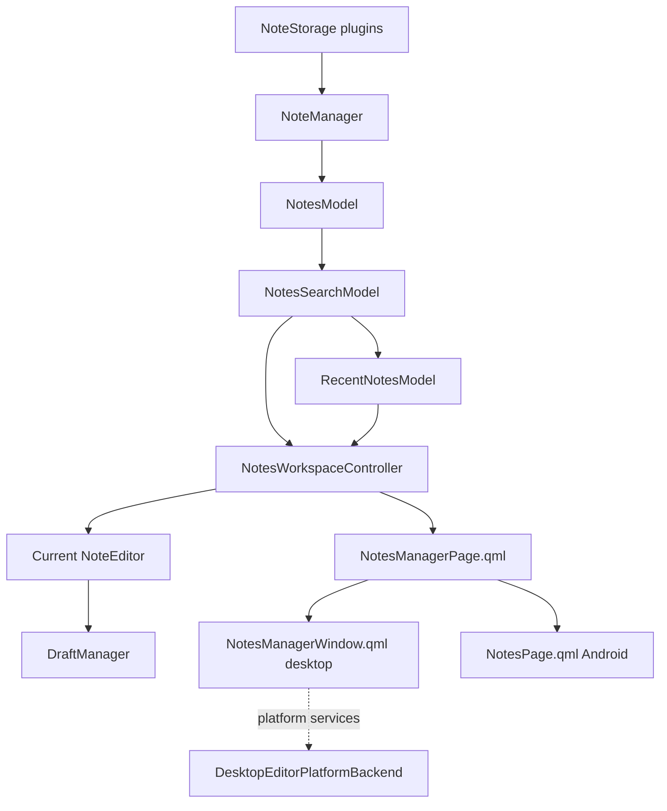
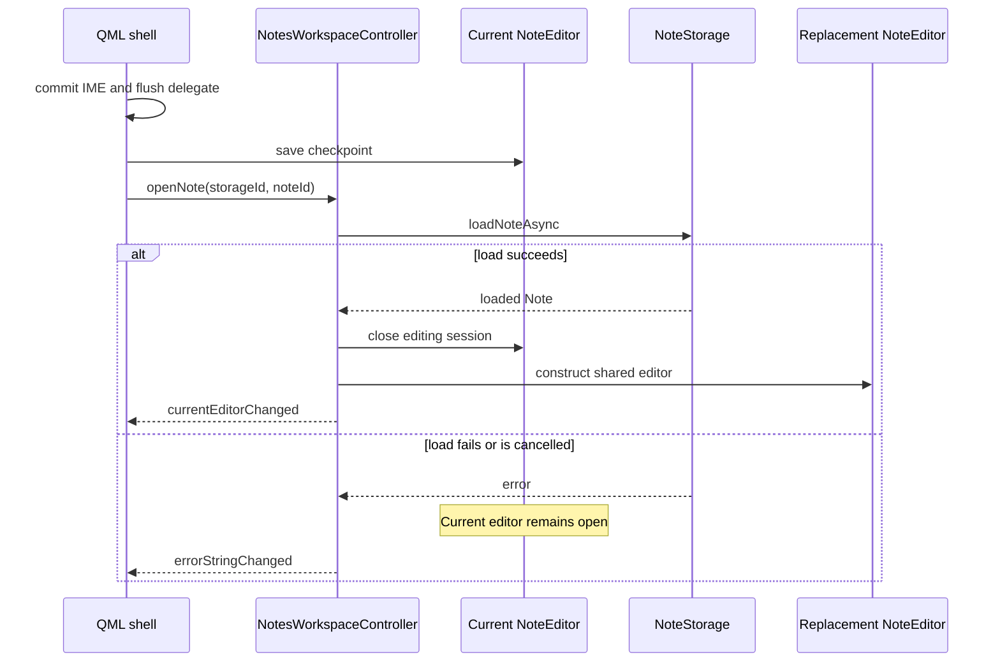

# Notes manager architecture

## Scope

The notes manager is a shared model/controller/QML feature. Desktop presents it
in a pure Qt Quick top-level window. Android presents the same notes list and
workspace through mobile navigation. No manager-specific editor or draft
implementation is allowed.

## Components

### `NotesModel`

The source model is hierarchical: storage rows contain note rows. It exposes
stable QML roles for storage identity, note identity, title, preview, tags,
modified time, accessibility, loading/error state, total count, and pagination.
Each storage refresh is asynchronous and independently cancellable.

The model owns presentation data only. Drag/drop decodes source and destination
identity and emits a move request; it does not save or remove notes directly.

### `NotesSearchModel`

The proxy filters title and tags synchronously. Optional body search uses
`GlobalNoteFinder`. While a search is active the source model exposes all loaded
summaries so pagination cannot hide a matching note. Clearing the search restores
the previous visible page depth.

### `NotesWorkspaceController`

The controller owns the current `NoteEditor` and asynchronous note load job. It
is responsible for UI-level commands:

- open and switch notes;
- create, delete, and move;
- checkpoint, close, and focus reload;
- expose storage choices and operation state;
- request a separate desktop note window.

It does not duplicate draft rules. Before a switch the QML shell flushes and
checkpoints the current delegate. The controller keeps the old editor active
until the replacement note has loaded successfully. A failed or cancelled load
therefore cannot discard the user's current editing session.

Move is staged as a destination Ready draft. For the currently edited note,
the destination is staged before the source editing checkpoint is discarded, so
a staging failure cannot lose local edits and the source cannot be republished
concurrently. The source storage note is queued for removal only after the
destination publication succeeds. Publication signals for unrelated drafts are
ignored by the workspace controller.

## Desktop shell

`NotesManagerWindow` creates one `QQmlApplicationEngine`, a
`NotesWorkspaceController`, and a `DesktopEditorPlatformBackend`, then loads
`NotesManagerWindow.qml`. The manager is a native Qt Quick top-level window;
there is no `QDialog -> QSplitter -> NoteWidget -> QQuickWidget` nesting.

This also means the first Quick renderer is not inserted into an already-visible
QWidget hierarchy, avoiding the former splitter/native-window recreation path.
Window geometry and navigation width are persisted by the C++ window adapter through `QSettings`.

## Android shell

`MobileApplication` exposes the same workspace and proxy model. `NotesPage.qml`
uses `NotesManagerPage.qml` in list-only mode. Selecting or creating a note sets
the shared current `NoteEditor`; the existing `StackView` then opens
`NoteEditorPage.qml`.

Android keeps its own navigation, Back, IME, background, and process-recovery
adapters. It does not have a second notes model or editor controller.

## Focus and switching protocol

Receiving window focus reloads only a newer Editing checkpoint and only when the
current editor is clean. Losing focus checkpoints the current editor. Neither
operation publishes the note.

## Desktop ABI

The migration removes the public `QmlNoteEditor` and `NoteManagerDlg` classes
and replaces them with `DesktopNoteEditorHost`,
`DesktopEditorPlatformBackend`, and `NotesManagerWindow`. The product version
remains independent, while the shared-library soname uses
`QTNOTE_ABI_VERSION=2` to make this incompatible desktop ABI explicit.

## Known follow-up work

- Persist expanded storage rows and selection more precisely.
- Add large-list/backend pagination when storage APIs expose stable page tokens.
- Add batch selection and batch move/delete.
- Highlight body-search matches in the opened editor.
- Coordinate deletion with another simultaneously dirty editor of the same
  logical note.
- Connect Android-compatible plugin runtimes to the explicit bundled factory
  registry after separating them from desktop UI dependencies.
- Add a touch-first move action. Delete is available both by swiping a recent
  row and from the editor toolbar; desktop retains its context menu.
- Move remaining find/print/pin/speech and plugin-specific actions out of the
  legacy QWidget shell before deleting `NoteEdit` and `NoteWidget`.
