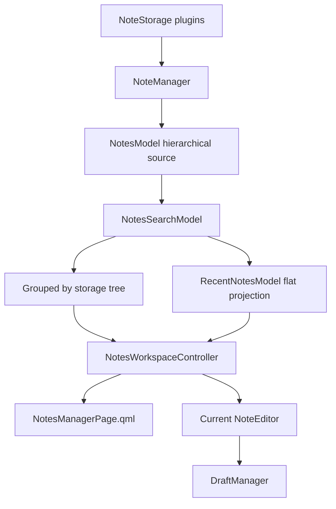

# Notes manager architecture

## Scope

The notes manager is a shared model/controller/QML feature. Desktop presents it
in a pure Qt Quick top-level window. Android presents the same models and page
through mobile navigation. No manager-specific editor or draft implementation
is allowed.

## Models and views

Two user-facing projections are implemented:

1. **Recent** — a flat list sorted by modification time. Storage headings are
   omitted; the storage is represented by its note icon and a hover tooltip.
2. **By storage** — a tree whose storage rows contain note rows.

Folder grouping is intentionally not simulated with tags or a second storage
loader. It will be added later as another projection once folder identity,
nesting, moves and cross-storage semantics are specified.

Both current modes use compact, vertically centred one-line rows. Desktop rows
are 34 px; touch rows retain a 44 px target. Background is only shown for hover
or selection. Failed or unavailable icon resources have textual fallbacks, and
the core tray icon is linked into the Android target.

## Search

The view selector is a tab bar. Search is collapsed by default behind a search
button. Opening it animates a panel containing the query field and **Search in
text**, then gives keyboard focus to the query. Closing the panel clears both
filters.

`NotesSearchModel` filters title and tags synchronously and optionally launches
the shared asynchronous body finder. `RecentNotesModel` is a projection of the
filtered hierarchical model, so search does not create a second refresh path.

## Ownership

`NotesModel` owns presentation snapshots and per-storage loading/error/pagination
state. `NotesWorkspaceController` owns only selection, asynchronous open/move/
delete commands and the current shared `NoteEditor`. Draft leases, checkpoint,
reload and publication remain inside `NoteEditor` and `DraftManager`.

## Desktop and Android

Desktop uses `NotesManagerWindow.qml`. Android starts in Recent mode and exposes
swipe-right deletion plus Delete in the open-note toolbar. Desktop defaults to
By storage. The same `NotesManagerPage.qml` implements both layouts.

## ABI

The notes-manager migration originally introduced ABI version 2. The subsequent
QWidget-free plugin/storage settings and `QWindow` desktop-integration contracts
raise the current libqtnote ABI to 3.
