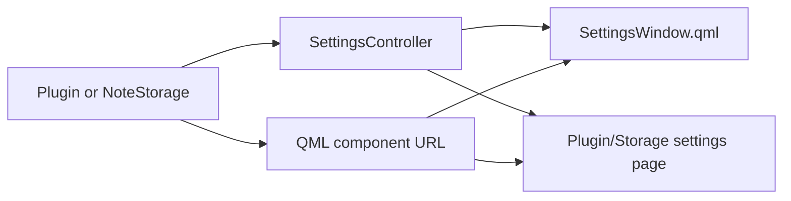

# Common settings API

## Status

Implemented. Plugin and storage configuration no longer crosses the public API
as `QWidget *` or `QDialog *`. Desktop and Android render the same controller
and QML component.

## Contract

`SettingsProviderInterface` exposes:

```cpp
QUrl settingsComponent() const;
SettingsController *createSettingsController(QObject *parent);
```

`NoteStorage` exposes the same pair directly. A provider may return the shared
`qrc:/qml/SettingsForm.qml` for schema-driven settings or a custom QML component
for complex workflows.

`SettingsController` is a UI-neutral `QAbstractListModel`. Its standard field
schema covers text, password, multiline text, boolean, integer, choice and
read-only values, descriptions, placeholders, ranges and restart requirements.
It owns validation, Apply and Reset semantics. A custom QML page may add
provider-specific properties and invokable commands while retaining the same
Apply/Reset lifecycle.



## Implemented providers

- local file storage;
- Nextcloud storage;
- Gemini speech provider;
- OpenAI Whisper speech provider;
- KDE integration options;
- Hunspell dictionary selection/download;
- XMPP account, encryption-key and OMEMO controls.

XMPP key-conflict recovery still invokes the existing internal desktop wizard
when automatic recovery cannot select a canonical key. This is an implementation
detail of that plugin, not part of the plugin/settings interface. It must be
migrated to a QML recovery flow before the XMPP runtime is admitted to the
Android bundled allow-list.

## ABI and compatibility

Removing the old widget-returning storage/plugin settings methods and changing
desktop integration to `QWindow *` are ABI-breaking changes. The libqtnote
SONAME is therefore `QTNOTE_ABI_VERSION=3`. External plugins must be rebuilt.
