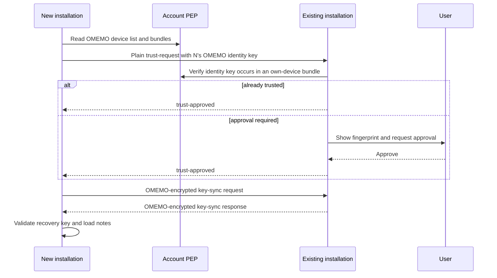

# Private Encrypted Notes over XMPP

Status: **ProtoXEP / implementation draft**
Version: **0.1**
Namespaces: `urn:xmpp:qtnote:encrypted:1`, `urn:xmpp:qtnote:key-sync:1`

> This document describes the protocol implemented by QtNote. It has not been
> submitted to or accepted by the XMPP Standards Foundation and does not have
> an assigned XEP number. Namespace names are provisional until standardization.

## Abstract

This specification defines a private, end-to-end encrypted note store built on
Personal Eventing Protocol (PEP), and a protocol for transferring its storage
key between a user's own authenticated OMEMO devices.

Notes are represented by separate index and content records. The server can
route changes and enumerate records, but cannot read note titles, tags,
timestamps, bodies, revisions, or the storage master key. Optimistic revisions
prevent silent overwrites. A user-approved trust bootstrap permits a new
installation to establish an OMEMO session with an existing installation
before the devices were previously trusted.

## Conformance language

The key words **MUST**, **MUST NOT**, **REQUIRED**, **SHOULD**, **SHOULD NOT**,
and **MAY** are to be interpreted as described by BCP 14 when, and only when,
they appear in all capitals.

An *account* is an XMPP bare JID. An *installation* is one QtNote instance with
a stable XMPP resource and OMEMO device. A *storage key* is the 32-byte secret
used to derive the encryption keys for note records. A *note ID* and a
*revision* are opaque, non-empty strings; QtNote generates UUIDs for both.

## Dependencies

An implementation of this protocol depends on:

- XMPP Core and Instant Messaging and Presence;
- Service Discovery (XEP-0030);
- Publish-Subscribe (XEP-0060) and PEP (XEP-0163);
- Persistent Storage of Private Data via PubSub (XEP-0223);
- OMEMO Encryption (XEP-0384) for storage-key transport;
- AES-256-GCM, HKDF-SHA-256, SHA-256, and a cryptographically secure random
  number generator.

OMEMO device lists, bundles, sessions, and trust are not redefined here.

## Protocol identifiers

The default base node is:

```text
urn:xmpp:qtnote:notes:0
```

An implementation derives two leaf nodes from the configured base node:

| Purpose | Node |
| --- | --- |
| Search/list metadata | `<base>:index:1` |
| Note body | `<base>:content:1` |

The default nodes are therefore:

```text
urn:xmpp:qtnote:notes:0:index:1
urn:xmpp:qtnote:notes:0:content:1
```

Encrypted PubSub payloads use `urn:xmpp:qtnote:encrypted:1`. Direct key
synchronization uses `urn:xmpp:qtnote:key-sync:1`.

The zero in the base node identifies the note data model. The final one on
each derived node identifies the wire representation of that record kind.
Changing either version requires a new identifier; implementations MUST NOT
silently interpret an unknown version as a known one.

## Discovery and server requirements

Before using the store, a client MUST discover its own bare JID and verify:

1. a `pubsub/pep` service identity is advertised; and
2. `http://jabber.org/protocol/pubsub#publish-options` is advertised.

Every QtNote installation capable of key transfer MUST advertise:

```xml
<feature var='urn:xmpp:qtnote:key-sync:1'/>
```

An installation SHOULD use a stable, distinct XMPP resource. A requester MUST
send key-sync IQs to a full JID discovered as online and advertising the
feature; it MUST NOT send a storage key to a bare JID.

The index node notification feature is advertised as the node followed by
`+notify`, for example:

```xml
<feature var='urn:xmpp:qtnote:notes:0:index:1+notify'/>
```

## PEP node configuration

Both nodes MUST be leaf nodes and MUST be configured with at least:

| PubSub option | Required value |
| --- | --- |
| `pubsub#access_model` | `whitelist` |
| `pubsub#persist_items` | `true` |
| `pubsub#max_items` | `max`, or the largest safe server value |
| `pubsub#deliver_payloads` | `true` |
| `pubsub#notify_retract` | `true` |
| `pubsub#type` | `urn:xmpp:qtnote:encrypted:1` |

A client MUST verify the effective access model and persistence after creating
or repairing a node. It MUST refuse to publish private note data if the node is
not allowlist-only and persistent. Publish requests MUST repeat the
allowlist/persistence requirements using publish-options when supported.

Example configuration form (irrelevant server-specific fields omitted):

```xml
<iq type='set' id='configure-index' to='romeo@example.net'>
  <pubsub xmlns='http://jabber.org/protocol/pubsub#owner'>
    <configure node='urn:xmpp:qtnote:notes:0:index:1'>
      <x xmlns='jabber:x:data' type='submit'>
        <field var='FORM_TYPE' type='hidden'>
          <value>http://jabber.org/protocol/pubsub#node_config</value>
        </field>
        <field var='pubsub#access_model'><value>whitelist</value></field>
        <field var='pubsub#persist_items'><value>true</value></field>
        <field var='pubsub#deliver_payloads'><value>true</value></field>
        <field var='pubsub#notify_retract'><value>true</value></field>
        <field var='pubsub#type'>
          <value>urn:xmpp:qtnote:encrypted:1</value>
        </field>
      </x>
    </configure>
  </pubsub>
</iq>
```

## Encrypted record syntax

Each PubSub item contains exactly one `encrypted` element:

```xml
<item id='2b7e1516-28ae-4d2a-abf7-158809cf4f3c'>
  <encrypted xmlns='urn:xmpp:qtnote:encrypted:1'
             schema='1'
             kind='index'
             key-id='E7ZpTDZ8t3F5y_xW6xX3F6EtJ7qlhQys6Kc_UJfHRmE'>
    UU5TRQABAAAADJ7b...BASE64...QfQ=
  </encrypted>
</item>
```

The attributes and content have these meanings:

- the PubSub item `id` is the note ID and MUST be non-empty;
- `schema` MUST be `1`;
- `kind` MUST be `index` on the index node and `content` on the content node;
- `key-id` is unpadded Base64url of a 32-byte storage-key identifier;
- element text is standard Base64 of a non-empty encrypted envelope.

A client MUST reject a record with an unknown schema, wrong kind, malformed
key ID, malformed envelope, or a decrypted note ID that differs from the item
ID.

### Storage key identifier

For a 32-byte storage master key `K`, the identifier is:

```text
SHA-256("QtNote storage key id v1" || 0x00 || K)
```

The identifier is not secret. It allows a client to select a candidate key
without attempting decryption and allows an audit to group records by key.

### Key separation

Index and content encryption keys are derived independently using HKDF-SHA-256.
The extract salt is the UTF-8 string `QtNote HKDF salt v1`. The expand info is:

```text
"QtNote key domain v1:" || domain || 0x01
```

where `domain` is `storage-index` or `storage-content`. The 32-byte HMAC output
is used directly as the AES-256-GCM key.

### Associated data

Encryption is bound to all of the following values:

- key domain;
- complete PubSub node name;
- PubSub item/note ID;
- schema number;
- record kind.

The current implementation serializes these values using `QDataStream` version
`Qt_5_10`, prefixed by magic `QNAD` (`0x514e4144`) and version `1`. This binary
encoding is normative for wire version 1. A future interoperable revision
SHOULD replace the framework-specific encoding with a language-neutral format
under a new wire identifier.

In exact field order the associated-data stream is:

```text
quint32 magic = 0x514e4144 ("QNAD")
quint16 version = 1
quint8 domain (2 = storage-index, 3 = storage-content)
QString complete-node-name
QString note-id
quint32 schema
QString kind ("index" or "content")
```

The stream uses the default big-endian `QDataStream` byte order. `QString` and
`QByteArray` use the serialization defined by `QDataStream` version `Qt_5_10`.

The associated-data byte string is included inside the authenticated plaintext
and compared after AES-GCM authentication. Thus moving ciphertext between a
node, item, schema, or record kind MUST fail authentication.

### Envelope version 1

The decoded envelope is a `QDataStream` `Qt_5_10` sequence:

```text
quint32 magic = 0x514e5345 ("QNSE")
quint16 version = 1
QByteArray nonce (12 bytes)
QByteArray authentication-tag (16 bytes)
QByteArray ciphertext
```

AES-256-GCM encrypts another `QDataStream` sequence containing the associated
data byte array followed by the UTF-8 JSON plaintext byte array. A decoder MUST
authenticate before parsing JSON and MUST compare the embedded associated data
with the expected byte string.

## Plaintext record models

All JSON is UTF-8 and SHOULD be serialized compactly. Field order is not
significant. Unknown fields MAY be ignored within the same schema.

### Index record

```json
{
  "id": "2b7e1516-28ae-4d2a-abf7-158809cf4f3c",
  "revision": "61d5965e-ce41-4a3b-b224-fb5576cce40f",
  "parentRevision": "",
  "originId": "c2ae77a6-4a07-45bf-8fd7-c60984d46217",
  "title": "Shopping list",
  "modified": "2026-07-13T10:21:31.487Z",
  "format": "markdown",
  "tags": ["personal", "errands"]
}
```

`id`, `revision`, `modified`, and `format` are REQUIRED. `revision` MUST be
non-empty, `modified` MUST be a valid UTC timestamp, and schema 1 supports only
`markdown`. `parentRevision` is empty for an initial revision. `originId`
identifies the installation that created the revision.

### Content record

```json
{
  "id": "2b7e1516-28ae-4d2a-abf7-158809cf4f3c",
  "revision": "61d5965e-ce41-4a3b-b224-fb5576cce40f",
  "content": "# Shopping list\n\n- Coffee\n- Bread\n"
}
```

The content `id` and `revision` MUST exactly match the corresponding decrypted
index record. A mismatch MUST be treated as incomplete or inconsistent remote
state, never as valid note content.

## Synchronization operations

### Listing and loading

A client lists item IDs from the index node, then requests index items in
batches. The QtNote implementation uses batches of 50. A server or library MAY
use RSM pagination instead. If only a truncated page can be obtained, the
result MUST be marked partial; the client MUST NOT infer that missing local
notes were deleted.

To load a note, the client requests and validates its index item, then requests
and validates the content item with the same ID and revision. Because the two
items are stored in separate nodes, a reader can observe an old index and new
content while a writer is between the two publications. An ID/revision mismatch
in this specific situation SHOULD be treated as a transient inconsistent
snapshot: the reader SHOULD request both items again. It MUST NOT combine the
two revisions or report either payload as corrupt solely because of this race.

### Creating and updating

For a new note, the client generates a note ID and revision. For an update, it
MUST first load the current server index and compare its revision with the
revision on which the local edit was based. If they differ, the client MUST
report a conflict and MUST NOT silently publish over the remote revision.

On a successful update the old revision becomes `parentRevision`, a new
revision is generated, and `modified` is set to the current UTC time.

The content item MUST be published before the index item. This ordering avoids
an index notification pointing to content that has not yet been uploaded.
Publication is not transactional: after interruption, a content record can be
newer than the index. Readers MUST regard the index revision as authoritative;
writers SHOULD retry or repair incomplete publication.

### Concurrent updates and conflict resolution

The revision comparison above is optimistic rather than an atomic
compare-and-swap. Two writers can load the same revision, both pass the check,
and publish different child revisions with the same `parentRevision`. These are
called *sibling revisions*. The last index item accepted by the PubSub service
is the visible remote version, but the other edit MUST NOT be silently lost by
a client that still has its plaintext or durable draft.

Conflict detection and conflict resolution are separate concerns. This
protocol requires a client to preserve the losing local edit and expose it to
a resolution policy; it does not prescribe a user interface or merge
algorithm. A policy MAY merge the versions, retain the draft for a later
decision, discard it with explicit user consent, or publish it as a new note
with a new note ID. Publishing a conflict copy MUST clear the old revision and
parent-revision metadata so that it is a genuine create operation rather than
another update of the contested item.

QtNote's default lossless policy keeps the server winner under the original
note ID and publishes the losing local edit as a new note titled
`<title> (conflict <local time>)`. It also notifies the user. For a conflict
detected before publication, the remote note is passed directly to the policy.
For sibling revisions detected from a PEP event after publication, only the
installation that authored the displaced cached revision creates the copy;
other installations simply converge on the server winner. `originId` is used
to make that ownership decision and avoid duplicate conflict copies.

Conflict drafts SHOULD be persisted before invoking an interactive or
asynchronous resolver. A crash, restart, resolver cancellation, or temporary
publication failure MUST NOT discard the losing edit.

Example index publication:

```xml
<iq type='set' id='publish-index' to='romeo@example.net'>
  <pubsub xmlns='http://jabber.org/protocol/pubsub'>
    <publish node='urn:xmpp:qtnote:notes:0:index:1'>
      <item id='2b7e1516-28ae-4d2a-abf7-158809cf4f3c'>
        <encrypted xmlns='urn:xmpp:qtnote:encrypted:1'
                   schema='1' kind='index'
                   key-id='E7ZpTDZ8t3F5y_xW6xX3F6EtJ7qlhQys6Kc_UJfHRmE'>
          UU5TRQABAAAADJ7b...BASE64...QfQ=
        </encrypted>
      </item>
    </publish>
    <publish-options>
      <x xmlns='jabber:x:data' type='submit'>
        <field var='FORM_TYPE' type='hidden'>
          <value>http://jabber.org/protocol/pubsub#publish-options</value>
        </field>
        <field var='pubsub#access_model'><value>whitelist</value></field>
        <field var='pubsub#persist_items'><value>true</value></field>
      </x>
    </publish-options>
  </pubsub>
</iq>
```

### Deleting

Deletion retracts the index item first, then the content item, with subscriber
notification requested. This makes the note disappear from normal listings as
soon as possible. `item-not-found` is idempotent success. A client MUST retain
and retry the second retraction after a transient failure; it SHOULD eventually
clean up orphaned content.

### Events

Clients process publish and retract events only for the configured index node
and only when they originate from the user's own PEP service. A server MAY omit
the service JID where the PEP context is unambiguous. A purge or node deletion
invalidates the complete local view and requires a fresh synchronization.

```xml
<message type='headline' from='romeo@example.net'
         to='romeo@example.net/QtNote-laptop'>
  <event xmlns='http://jabber.org/protocol/pubsub#event'>
    <items node='urn:xmpp:qtnote:notes:0:index:1'>
      <retract id='2b7e1516-28ae-4d2a-abf7-158809cf4f3c'/>
    </items>
  </event>
</message>
```

## Storage-key synchronization

The storage key is transferred only between full JIDs belonging to the same
bare JID. The responder MUST require explicit user approval unless the
requester's OMEMO identity is already manually trusted or authenticated.

The complete onboarding sequence is:



### Trust bootstrap request

Before an OMEMO session exists, the requester sends a plaintext IQ to the
existing installation. Its `senderKey` is the standard-Base64 OMEMO identity
public key of the requesting device. It is public authentication material, not
the storage key.

```xml
<iq type='set'
    from='romeo@example.net/QtNote-new'
    to='romeo@example.net/QtNote-existing'
    id='86de9c36-bc10-41e2-b239-b202de0b0a19'>
  <key-sync xmlns='urn:xmpp:qtnote:key-sync:1'>
    {&quot;requestId&quot;:&quot;86de9c36-bc10-41e2-b239-b202de0b0a19&quot;,
     &quot;senderKey&quot;:&quot;ht4nXjYzM9...BASE64...WLQ=&quot;,
     &quot;type&quot;:&quot;trust-request&quot;}
  </key-sync>
</iq>
```

Whitespace is shown for readability; QtNote sends compact JSON. `requestId`
MUST be non-empty and SHOULD equal the IQ `id`. The receiver MUST verify all of
the following before displaying or approving the request:

1. the sender bare JID equals the configured account bare JID;
2. the stanza is not marked as end-to-end encrypted;
3. `senderKey` decodes to a non-empty public identity key;
4. the same key occurs in a currently published OMEMO bundle for another device
   in the account's OMEMO device list.

This PEP lookup prevents an arbitrary same-account resource from substituting
an unrelated key. It does not replace user fingerprint verification.

### Trust acknowledgement

After approval, the responder assigns an OMEMO trust level to the identity and
returns a plaintext result:

```xml
<iq type='result'
    from='romeo@example.net/QtNote-existing'
    to='romeo@example.net/QtNote-new'
    id='86de9c36-bc10-41e2-b239-b202de0b0a19'>
  <key-sync xmlns='urn:xmpp:qtnote:key-sync:1'>
    {&quot;requestId&quot;:&quot;86de9c36-bc10-41e2-b239-b202de0b0a19&quot;,
     &quot;type&quot;:&quot;trust-approved&quot;}
  </key-sync>
</iq>
```

This acknowledgement MUST NOT contain the storage key. The requester MUST
match both IQ ID and JSON `requestId`.

### Encrypted key request

The requester next sends an IQ whose application payload, after OMEMO
decryption, is:

```xml
<iq type='set' id='278a35de-3aa8-40e5-bc49-a2ad697b9803'>
  <key-sync xmlns='urn:xmpp:qtnote:key-sync:1'>
    {&quot;requestId&quot;:&quot;278a35de-3aa8-40e5-bc49-a2ad697b9803&quot;,
     &quot;type&quot;:&quot;request&quot;}
  </key-sync>
</iq>
```

On the wire, the application element is carried by the implementation's OMEMO
IQ envelope, for example:

```xml
<iq type='set'
    from='romeo@example.net/QtNote-new'
    to='romeo@example.net/QtNote-existing'
    id='278a35de-3aa8-40e5-bc49-a2ad697b9803'>
  <encrypted xmlns='urn:xmpp:omemo:2'>...</encrypted>
</iq>
```

The receiver MUST ignore a `type=request` payload that was not obtained through
authenticated end-to-end decryption. It MUST bind the pending request to the
sender full JID, IQ ID, OMEMO sender identity, and encryption metadata.

### Encrypted key response

After the requester identity is trusted, the responder returns an
OMEMO-protected IQ result. No second prompt is required: approval of an
untrusted identity authorizes this storage-key request. Its decrypted
application payload is:

```xml
<iq type='result' id='278a35de-3aa8-40e5-bc49-a2ad697b9803'>
  <key-sync xmlns='urn:xmpp:qtnote:key-sync:1'>
    {&quot;recoveryKey&quot;:&quot;qtnote-key-v1:BASE64URL_KEY:12ab34cd56ef&quot;,
     &quot;requestId&quot;:&quot;278a35de-3aa8-40e5-bc49-a2ad697b9803&quot;,
     &quot;type&quot;:&quot;response&quot;}
  </key-sync>
</iq>
```

The response MUST be encrypted using the metadata/session associated with the
accepted request. A receiver MUST verify the IQ ID, `requestId`, response type,
OMEMO authentication, recovery-key syntax, key length, and checksum before
installing the key.

The recovery key syntax is:

```text
qtnote-key-v1:<unpadded-base64url-32-byte-key>:<12-lowercase-hex-digits>
```

The checksum is the first six bytes of the storage key identifier. It detects
copying and framing errors; it is not an authentication mechanism. OMEMO and
explicit trust provide authentication.

### Rejection and timeout

The current protocol deliberately does not reveal whether a request was
rejected, expired, malformed, or referred to an unknown identity: the receiver
may discard it and the requester observes a timeout. An implementation MAY
return an XMPP IQ error, but MUST NOT include the storage key or sensitive trust
state in an error. Pending requests SHOULD expire locally and MUST NOT be reused
after completion or rejection.

Transient transport errors MAY be retried with a new request ID. User rejection,
invalid credentials, malformed data, failed identity verification, or a
permanent authorization error MUST NOT be retried automatically.

## Multiple storage keys and migration

An account can contain notes written with different storage keys, for example
after independently initialized installations were used. A client MAY audit
index records by `key-id`, request candidate keys from trusted online
installations, and ask the user to select one canonical key.

Migration MUST decrypt both index and content with the record's old key,
validate their IDs and revisions, re-encrypt both with the canonical key, then
publish content before index. Records for which no matching key is available
MUST remain untouched and MUST be reported as inaccessible.

## Error handling

Errors fall into three classes:

| Class | Examples | Required behavior |
| --- | --- | --- |
| Permanent configuration | bad credentials, no PEP, no publish-options, public/non-persistent node | stop and require user/configuration action |
| Data/authentication | unknown schema, wrong key ID, GCM failure, persistent ID/revision mismatch, unverified key-sync sender | do not overwrite or auto-repair ciphertext; report or ignore safely |
| Transient | disconnected network, timeout, temporary server error, index/content mismatch during a publication window | retain the operation and retry with bounded exponential backoff; retry a complete note snapshot for a publication-window mismatch |

Publication and deletion are multi-step operations. A conforming writer SHOULD
persist enough encrypted operation state to resume after restart. It MUST NOT
discard an acknowledged conflict and MUST NOT convert a partial list into
deletions.

## Security considerations

### Server-visible metadata

Encryption does not hide the account JID, node names, note IDs, record count,
item sizes, update timing, device IDs, device labels, OMEMO bundles, or the fact
that key synchronization occurs. Applications needing resistance to this
traffic analysis require padding, batching, and possibly a different transport.

### Trust bootstrap

Publishing an OMEMO identity key proves only that the account published it; an
attacker controlling the account or server can change PEP data. The user SHOULD
compare fingerprints over an independent channel before approval. A receiver
MUST never auto-approve an unrelated bare JID.

The plaintext `trust-request` intentionally exposes only a public OMEMO identity
key. The storage master key MUST appear only in the authenticated encrypted
response.

### Compromise and revocation

Any installation holding the storage key can decrypt every record encrypted
under that key. Removing an OMEMO device does not revoke a previously obtained
storage key. After compromise, the user MUST create a new canonical storage key,
re-encrypt all accessible notes, remove the compromised OMEMO device and bundle,
and stop trusting its identity.

### Nonce and key reuse

AES-GCM nonces MUST be 12 unpredictable bytes and MUST NOT repeat for the same
derived key. Implementations MUST use a cryptographically secure random source.
Index and content domain separation limits cross-purpose key reuse.

### TLS

Clients MUST require TLS with normal certificate validation even though note
content and storage-key transfer are end-to-end encrypted. TLS protects XMPP
credentials and reduces metadata manipulation and downgrade opportunities.

## Interoperability and evolution

Version 1 intentionally documents QtNote's deployed binary format. Its use of
Qt `QDataStream` makes an independent implementation possible but needlessly
couples it to Qt serialization details. Before submission as a general XEP, a
new wire version SHOULD define language-neutral canonical encoding for the
envelope and associated data, formal XML schemas, size limits, standardized IQ
errors, and test vectors.

Implementations MUST preserve unknown records and MUST NOT rewrite them merely
because their schema or key is unsupported. A new schema, encryption algorithm,
or incompatible JSON model requires a new versioned namespace/node identifier.

## XMPP Registrar considerations

No registrar entries currently exist. A future XEP submission needs to request
permanent namespaces (or replace the provisional QtNote-specific URNs), define
their XML schemas, and register the service-discovery feature and PubSub payload
type.

## Implementation status

QtNote's `xmpppubsub` plugin implements this draft, including private-node
verification, index/content synchronization, optimistic conflicts, persistent
retryable publication/deletion operations, OMEMO trust bootstrap, storage-key
transfer, key audit, and canonical-key migration.

Known protocol-level limitations are:

- the binary envelope and associated-data encoding depend on `QDataStream`;
- deletion and two-record publication are recoverable but not atomic;
- rejection is currently represented by timeout rather than an explicit IQ
  error;
- responder-side pending requests do not yet have an explicit expiry timer;
- the fallback path for servers without item-ID discovery can return a partial
  list;
- no formal XML Schema or conformance test vectors are included yet.

## References

- [RFC 6120: Extensible Messaging and Presence Protocol (XMPP): Core](https://www.rfc-editor.org/rfc/rfc6120)
- [RFC 6121: XMPP Instant Messaging and Presence](https://www.rfc-editor.org/rfc/rfc6121)
- [RFC 5869: HMAC-based Extract-and-Expand Key Derivation Function](https://www.rfc-editor.org/rfc/rfc5869)
- [XEP-0030: Service Discovery](https://xmpp.org/extensions/xep-0030.html)
- [XEP-0060: Publish-Subscribe](https://xmpp.org/extensions/xep-0060.html)
- [XEP-0163: Personal Eventing Protocol](https://xmpp.org/extensions/xep-0163.html)
- [XEP-0223: Persistent Storage of Private Data via PubSub](https://xmpp.org/extensions/xep-0223.html)
- [XEP-0384: OMEMO Encryption](https://xmpp.org/extensions/xep-0384.html)
