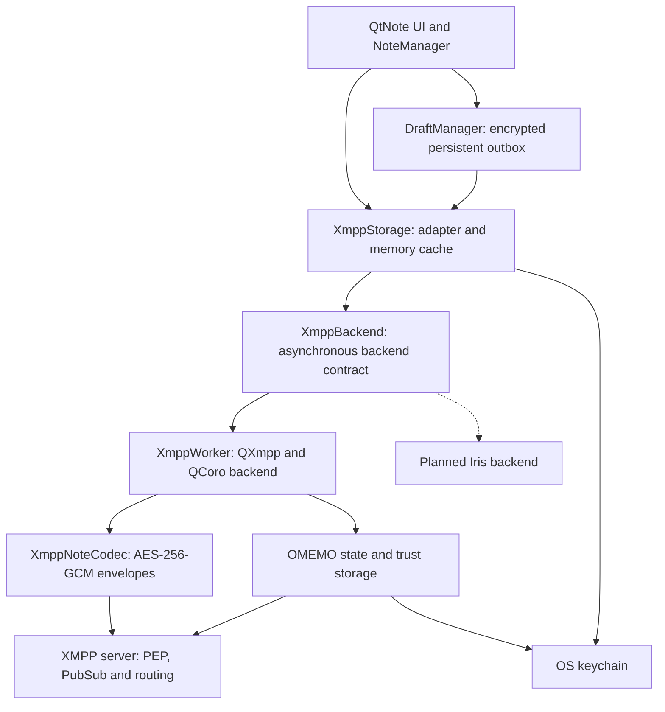
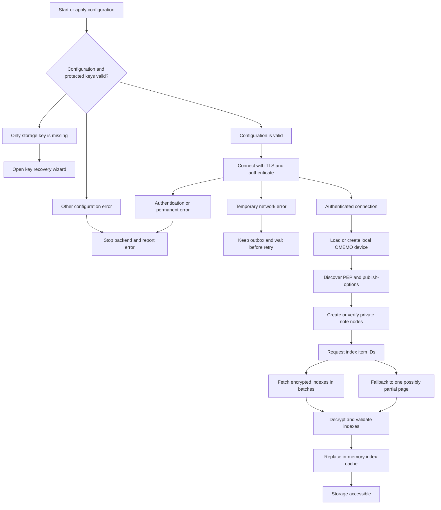
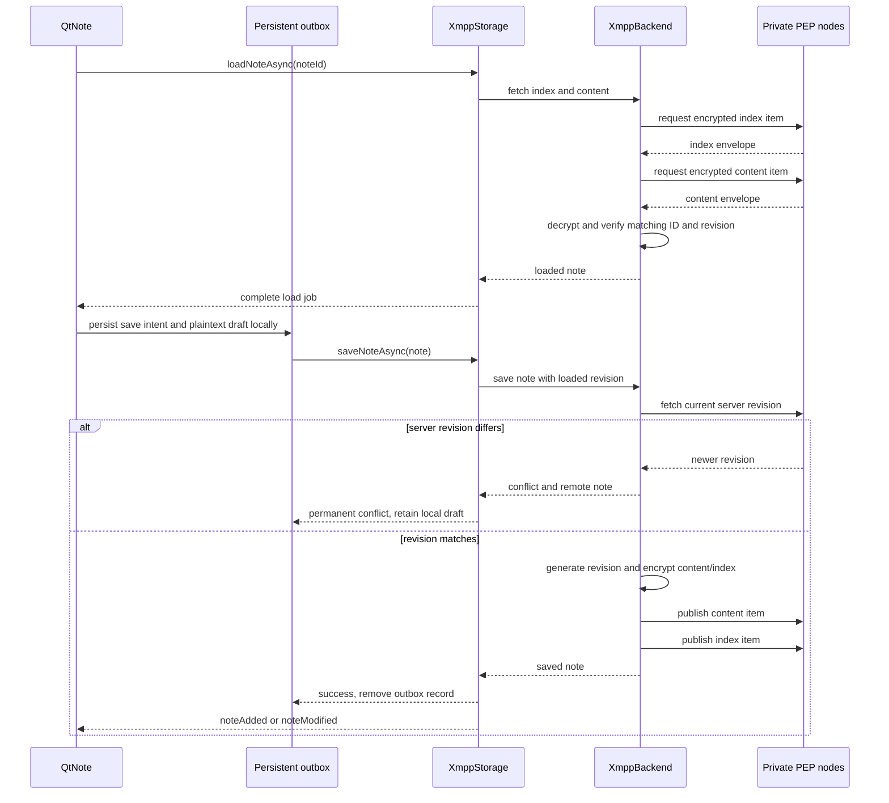
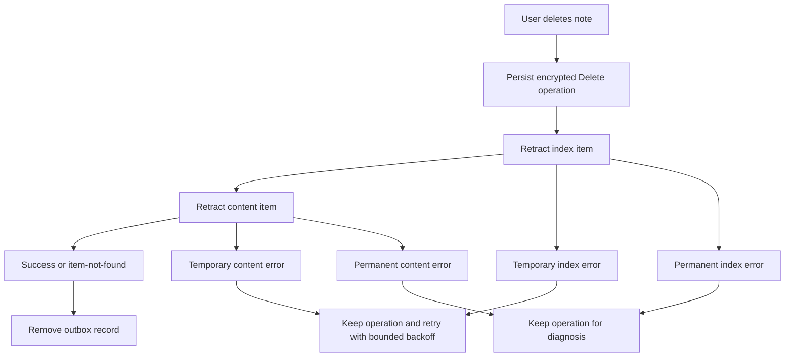
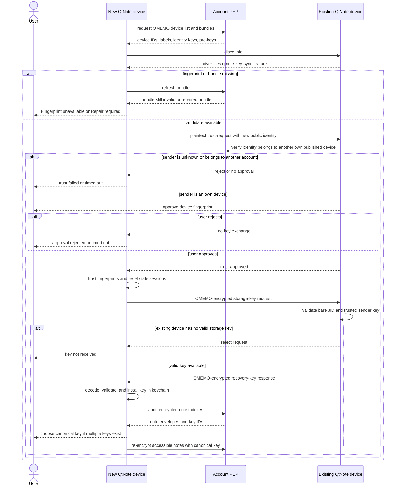
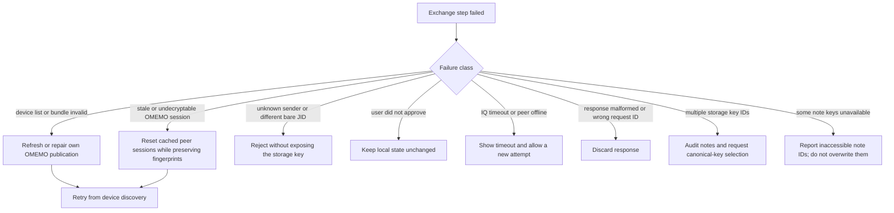

# XMPP Private Notes plugin

`xmpppubsub` is an encrypted QtNote storage backend. It synchronizes Markdown
notes between QtNote installations through the user's XMPP account using
private persistent PEP nodes.

The implemented wire protocol is documented separately in
[Private Encrypted Notes over XMPP](PROTOXEP.md). That document is a ProtoXEP
and implementation specification, not an XSF-assigned XEP.

The XMPP server stores encrypted note records and routes synchronization
events. Note plaintext and the QtNote storage master key are not published to
PEP. OMEMO is used to authenticate the user's QtNote devices and to transport
the storage key during device onboarding.

## Capabilities

- creates and verifies private persistent PEP nodes;
- stores the encrypted note index and content in separate nodes;
- lists notes in batches and supports the QXmpp/RSM-compatible item-ID path;
- creates, loads, updates, and retracts notes asynchronously;
- propagates publish, retract, purge, and node invalidation events;
- detects optimistic revision conflicts before publishing an update;
- keeps note publication and deletion operations in an encrypted persistent
  outbox and retries transient failures with exponential backoff;
- discovers the account's OMEMO devices and displays their fingerprints;
- repairs incomplete own-device OMEMO bundles produced after pre-key use;
- establishes trust between two own QtNote devices and transfers the storage
  key over an OMEMO-protected IQ;
- audits notes encrypted with different storage keys and can re-encrypt them
  with a selected canonical key;
- requires TLS and does not ignore certificate errors.

## Building

The plugin is available on Linux/Unix, macOS, and Windows. It is enabled by
default when all required development packages are present:

- Qt Network and Qt XML for the selected Qt major version;
- QXmpp 1.11 or newer;
- the matching QXmpp OMEMO library;
- QCoro Core for the matching Qt major version.

Configure QtNote normally to build the plugin:

```sh
cmake -S . -B build
cmake --build build
```

Disable it explicitly when building without the XMPP dependencies:

```sh
cmake -S . -B build -DQTNOTE_PLUGIN_ENABLE_xmpppubsub=OFF
```

The CMake cache option is named `QTNOTE_PLUGIN_ENABLE_xmpppubsub`. Dependency
detection controls its default value. Explicitly forcing it to `ON` while a
required package is unavailable produces a normal CMake target/dependency
error.

On Debian/Ubuntu the Qt 6 build uses, among the usual Qt development packages,
`libqxmppqt6-dev` (including the matching OMEMO CMake target) and
`qcoro-qt6-dev`. Package names may differ in other releases and distributions.

## Configuration

Open QtNote's plugin settings and configure **XMPP Private Notes**:

1. enter the bare JID and password;
2. optionally override the host and port;
3. keep a distinct resource for every installation (QtNote generates one from
   a stable installation UUID);
4. create/import a storage key, or obtain it from another trusted QtNote device;
5. apply the configuration and inspect the OMEMO device list.

The default base node is `urn:xmpp:qtnote:notes:0`. It expands to:

- `urn:xmpp:qtnote:notes:0:index:1` — encrypted title, tags, timestamp, format,
  revision, parent revision, and origin;
- `urn:xmpp:qtnote:notes:0:content:1` — encrypted note body bound to the same
  note ID and revision.

Both nodes must be persistent, payload-delivering, and allowlist-only. The
plugin refuses to use a server that does not advertise a PEP identity and
PubSub `publish-options`.

## Architecture

The storage-facing code does not depend directly on QXmpp. `XmppBackend` is the
asynchronous boundary intended for both the current QXmpp implementation and a
future Iris implementation.



### Component responsibilities

| Component | Responsibility |
| --- | --- |
| `XmppStorage` | QtNote `NoteStorage` adapter, configuration, in-memory cache, job completion, UI-facing errors |
| `XmppBackend` | backend-neutral asynchronous CRUD, lifecycle, OMEMO, audit, and key-sync contract |
| `XmppWorker` | current QXmpp implementation; connection, PEP, PubSub, OMEMO, and QCoro flows |
| `XmppPepExtension` | incoming PubSub event filtering and conversion to backend signals |
| `XmppKeySyncExtension` | `urn:xmpp:qtnote:key-sync:1` IQ parsing, request tracking, and replies |
| `XmppNoteCodec` | encryption/decryption and binding index/content to node, item ID, kind, and schema |
| `XmppOmemoStorage` | encrypted persistence of local OMEMO identity, sessions, and pre-keys |
| `XmppPersistentTrustStorage` | persistent OMEMO trust decisions |
| `XmppKeyResolutionDialog` | device trust, key audit, canonical-key choice, and recovery progress |
| `DraftManager` | durable publish/delete intent, retry scheduling, and recovery after restart |

QXmpp runs in Qt's normal event loop. There is no dedicated XMPP thread and no
nested `QEventLoop`; sequential protocol operations are QCoro tasks. XMPP is
primarily I/O-bound, so a second thread is not useful here. Expensive CPU work
can be isolated later without changing the backend contract.

## Connection and initial synchronization



Incoming index publication events update or invalidate the cache. Reconnect,
purge, and node deletion trigger a full refresh rather than assuming that the
event stream is complete.

Connection failures are classified by the backend. Authentication, TLS,
configuration, and protocol failures stop automatic reconnect until the user
changes the configuration. Socket failures, timeouts, temporary stream errors,
and retryable stanza errors keep local/outbox state intact and retry after 30,
60, 120, 240, and then 300 seconds. On Qt 6.4 or newer, a system reachability
change to an available network triggers an immediate attempt instead of waiting
for the current delay to expire.

## Note synchronization

### Load and save



Conflict detection is optimistic, not atomic compare-and-swap: XEP-0060 has no
`If-Match` equivalent. A narrow race remains between checking the server
revision and publishing. `parentRevision` and `originId` preserve enough
information for a future history/merge implementation.

Publishing content and index is also not a server-side transaction. Content is
published first and index second so readers never observe a new index pointing
at content that has not been uploaded. A failure between the two publications
leaves an unreferenced content revision; the durable outbox preserves the local
draft for retry.

### Delete

Deletion is also durable. QtNote first writes a `Delete` record to the encrypted
outbox, then retracts the index and content items asynchronously. Successful or
already-missing items complete the operation. A temporary error retains the
record and retries with a delay capped at five minutes.



## Storage-key exchange between own devices

The storage master key and the OMEMO identity key are different things:

- the random storage master key encrypts QtNote index/content envelopes;
- OMEMO device identities authenticate installations and protect the IQ that
  transports the encoded storage recovery key;
- trust is limited to devices published by the same bare JID and still requires
  explicit user approval when it cannot be established safely.

The first plaintext `trust-request` contains no storage key. It bootstraps trust
by presenting the new device's public OMEMO identity. The actual key request and
response are sent only after trust approval and are OMEMO encrypted.



### Error handling during key exchange



An incomplete OMEMO bundle is never accepted as a fingerprint. Repair only
restores the local device's publication when the server bundle has an empty
identity key and a previously cached bundle proves the expected identity. A
non-empty mismatching identity is not overwritten automatically.

## Encryption and privacy boundary

QtNote uses AES-256-GCM application-level envelopes. Associated data binds an
envelope to its key domain, node, item ID, schema, and payload kind. The index
and content payloads additionally cross-check note ID and revision.

The server can still observe:

- the account and connected resources;
- PEP node names and item UUIDs;
- ciphertext sizes, update timing, and deletion timing;
- OMEMO device IDs, labels, and public bundles.

It cannot derive note titles, bodies, tags, formats, revisions, or timestamps
from the encrypted QtNote payload without the storage master key.

Local drafts, pending deletions, the storage key, and OMEMO state are also
protected at rest. The storage key and OMEMO-state wrapping key are kept in the
platform keychain; encrypted draft/outbox and OMEMO state files live in the
QtNote data directory.

## Backend evolution and Iris

`XmppBackend` deliberately describes QtNote operations instead of exposing
QXmpp classes. An Iris backend should implement:

1. connection lifecycle and permanent/transient error classification;
2. PEP discovery/configuration and PubSub item events;
3. item-ID/RSM pagination;
4. asynchronous note CRUD returning the existing DTO result types;
5. OMEMO device, bundle, session, trust, and encrypted-IQ operations;
6. cancellation/shutdown semantics compatible with `StorageJob` ownership.

The current Psi OMEMO plugin is a useful implementation source, but OMEMO should
live behind the Iris backend rather than leak Psi plugin interfaces into
`XmppStorage`. Backend selection can later be made at build time or through a
factory without changing note synchronization or recovery UI.

## Current limitations

- the XMPP password is still stored in `QSettings`; it should move to the
  platform keychain;
- the note cache is in memory; the durable outbox protects local edits and
  deletions, but a cold start still refreshes indexes from PEP;
- there is no automatic merge UI or remote revision history;
- PubSub does not provide an atomic transaction across revision check, content
  publication, and index publication;
- the QXmpp implementation is the only backend currently shipped; Iris is an
  architectural extension point, not yet a selectable backend;
- servers that reject item-ID discovery fall back to one page, which may be
  partial when the server does not expose a usable continuation API.

## Suggested validation matrix

1. New account: create nodes, save, restart, load, edit, and delete.
2. Two online resources: verify publish/retract events in both directions.
3. Conflict: load one revision on two devices and save both independently.
4. Offline save/delete: restart before reconnecting and verify outbox recovery.
5. Fresh device: clear one installation and complete trust plus key transfer.
6. Rejected trust: verify no encrypted storage key is sent.
7. Broken/missing own bundle: verify Repair restores only the expected identity.
8. Different storage keys: audit, choose canonical key, and re-encrypt notes.
9. Missing historical key: verify inaccessible notes are reported and preserved.
10. Server without item-ID discovery: verify partial-page warning behavior.
